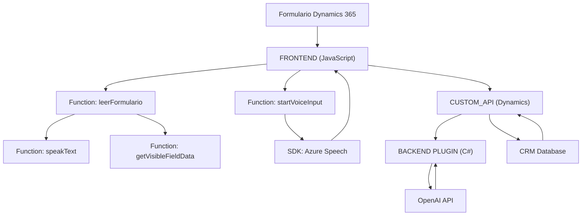

### Breve resumen técnico

Este repositorio corresponde a un sistema híbrido que integra Frontend dinámico (JavaScript) con un plugin backend implementado en C#. Las características principales del proyecto son la integración de **Azure Speech SDK** para el reconocimiento de voz, la transformación y síntesis de texto, así como una API personalizada para ampliar la funcionalidad en Microsoft Dynamics 365 mediante **Azure OpenAI**. Se enfoca en interactuar con formularios y realizar funciones como reconocimiento de voz, transformación y asignación de datos, actualizaciones dinámicas en UI y generación de JSON mediante un plugin de Dynamics CRM.

---

### Descripción de arquitectura

- **Arquitectura:** Seguimos una **arquitectura de capas típica**, donde existen las siguientes capas:  
  1. **Frontend (JavaScript en Dynamics 365)**: Maneja la interacción con el formulario e implementa funcionalidades de voz mediante Azure Speech SDK.  
  2. **Backend con plugin (C#)**: A nivel del servidor de Microsoft Dynamics CRM, el plugin implementa la lógica para la transformación de texto utilizando la API de Azure OpenAI. Este sigue una arquitectura **plugin-based** típica del ecosistema Dynamics CRM.  
  3. **Integración con servicios en la nube (SOA)**: Se implementa una **Service-Oriented Architecture**, al interactuar con servicios externos (Azure Speech SDK y Azure OpenAI).

- **Principales patrones observados**:
  - **Event-driven**: Uso de eventos y callbacks tanto para la interacción con el SDK como para el manejo de respuestas HTTP y para la ejecución de plugins según sus instancias.
  - **Facade**: Las funciones encapsulan lógica compleja y ofrecen una interfaz simplificada para consumo.
  - **Plugin pattern**: La implementación de `IPlugin` en el backend establece un punto de entrada que puede ser configurado por el entorno de Dynamics CRM.

---

### Tecnologías usadas

1. **Frontend (JavaScript)**:
   - **Plataforma:** Dynamics 365 CE (Common Data Service).
   - **Lenguaje:** JavaScript (con decisión por funciones modulares).
   - **Bibliotecas/SDKs:**  
     - Azure Speech SDK (`https://aka.ms/csspeech/jsbrowserpackageraw`) para reconocimiento y síntesis de voz.
     - Manejo de objetos de Dynamics 365 mediante APIs (`Xrm.WebApi.online`).

2. **Backend (C#)**:
   - **Plataforma:** Microsoft Dynamics CRM.
   - **Lenguaje:** C# .NET Framework.
   - **Frameworks y herramientas utilizadas:**
     - `Newtonsoft.Json.Linq` para manipulación de JSON en el backend.
     - `System.Net.Http` para realizar solicitudes HTTP a Azure OpenAI API.
     - `Microsoft.Xrm.Sdk`: Interfaz estándar para desarrollo de plugins en Dynamics CRM.
     - `Microsoft.Extensions.Configuration`: Opcional para lectura segura de configuraciones (no implementado pero recomendado).

3. **Servicios Externos**:
   - **Azure Speech SDK:** Para reconocimiento y síntesis de voz en tiempo real.
   - **Azure OpenAI API:** Para realizar transformaciones de texto mediante reglas dinámicas.

4. **Apis internas**:
   - **Custom APIs en Dynamics 365:** Extensiones del sistema CRM para registrar datos ingresados desde el SDK.

---

### Diagrama **Mermaid** válido para GitHub

---

### Conclusión final

El repositorio, cuyo propósito es procesar formularios por medio de entrada y síntesis de voz integrada con Dynamics 365, emplea una arquitectura de capas y patrones que refuerzan la modularidad y escalabilidad, aunque algunas áreas como la seguridad de las credenciales pueden ser mejoradas. La integración con Azure Speech SDK y OpenAI API hace que el sistema sea ideal para soluciones que exigen procesamiento dinámico de datos y respuestas rápidas basadas en voz e IA.