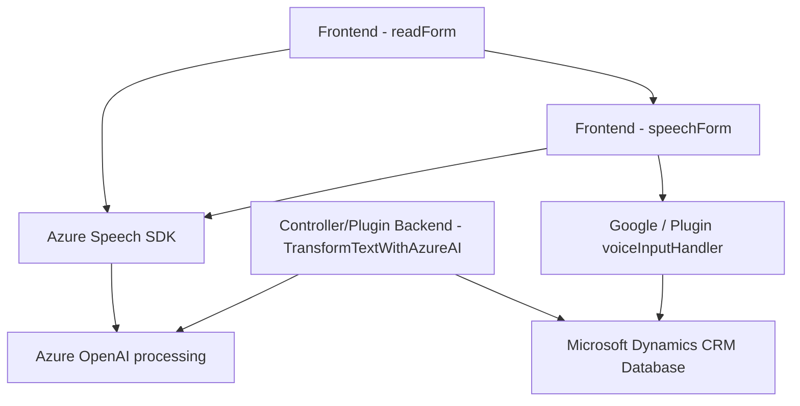

### Breve resumen técnico
El repositorio dado contiene diferentes archivos relacionados con la integración de un servicio de texto-a-voz (Azure Speech SDK) y procesamiento de texto avanzado con OpenAI Azure en Microsoft Dynamics CRM. Los archivos `readForm.js` y `speechForm.js` están dedicados al procesamiento de voz, interacción con formularios y SDKs; mientras que `TransformTextWithAzureAI.cs` implementa un plugin para transformar y estructurar texto en un contexto de CRM utilizando inteligencia artificial.

---

### Descripción de arquitectura
1. **Solución tipo**: La solución parece una combinación de una **API backend**, servicios para integración con SDK y un CRM.
   - La parte frontend (`readForm.js`, `speechForm.js`) interactúa directamente con los formularios y usuarios, utilizando voz como entrada y salida.
   - El plugin backend (`TransformTextWithAzureAI.cs`) transforma y procesa datos con inteligencia artificial conectándose al OpenAI Azure.

2. **Arquitectura**:
   - Monolítica extendida en **n capas**:
     - Capa de presentación: Se ocupa de la interacción usuario-formulario y voz.
     - Capa lógica: Procesa entrada y salida, conectando servicios como SDK y APIs.
     - Capa de datos y procesamiento: En el plugin se realizan transformaciones avanzadas y validaciones.
   - El uso del plugin y la lógica desafía una arquitectura totalmente desacoplada pero sigue siendo un sistema monolítico organizado.
   - Contiene aspectos de interacción **hexagonal**, ya que se conecta con varios servicios externos como Azure Speech SDK y OpenAI.

3. **Flujo de datos**:
   - El frontend gestiona entradas/salidas del usuario y se vincula al SDK para procesamiento (voz y texto).
   - El backend gestiona la lógica y procesamiento utilizando llamadas HTTP a APIs externas.

---

### Tecnologías y frameworks usados
1. **Frontend**:
   - JavaScript: Para lógica del cliente y vinculación con formularios CRM.
   - Azure Speech SDK: Para reconocimiento y síntesis de voz.

2. **Backend**:
   - C#: Plugin desarrollado usando Microsoft Dynamics CRM SDK.
   - Azure OpenAI: Para procesamiento de texto con GPT modelos.

3. **Puntos destacados**:
   - **Patrón Plugin**: Clasificación dentro de Microsoft CRM para extender funcionalidades.
   - **Integración SDK dinámica**: Carga del SDK de Azure mediante URL (`https://aka.ms/csspeech/jsbrowserpackageraw`).
   - **Sincronización y asincronismo**: Uso de promesas (en JS) y asincronismo en C# para manejar dependencias y API services.

---

### Dependencias externas/posibles componentes
1. **Servicios externos**:
   - Azure Speech SDK (texto-voz y voz-texto).
   - Azure OpenAI API para procesamiento de texto mediante inteligencia artificial.
   - Microsoft Dynamics CRM API (Xrm.WebApi) para interacción con los datos y estructura del CRM.
   
2. **Librerías externas** para backend:
   - `Newtonsoft.Json` y similares para manipulación JSON.
   - HTTPClient para realizar solicitudes HTTPS a APIs externas.

---

### Diagrama Mermaid

---

### Conclusión final
La solución es una plataforma híbrida centrada en la automatización de procesos CRM y accesibilidad mediante servicios de voz. Utiliza tecnologías modernas de Microsoft (Azure Speech SDK, OpenAI Azure) junto con la interacción de eventos en Dynamics CRM.

Aunque bien estructurada, la solución combina capacidades monolíticas con elementos hexagonales dentro de Microsoft Dynamics CRM, integrando SDKs y servicios externos como parte del flujo. La arquitectura es funcional, pero podría avanzar hacia una implementación más desacoplada (como microservicios) para mejorar escalabilidad y flexibilidad, especialmente para componentes de procesamiento con intensivo uso de APIs como Azure Speech y OpenAI.