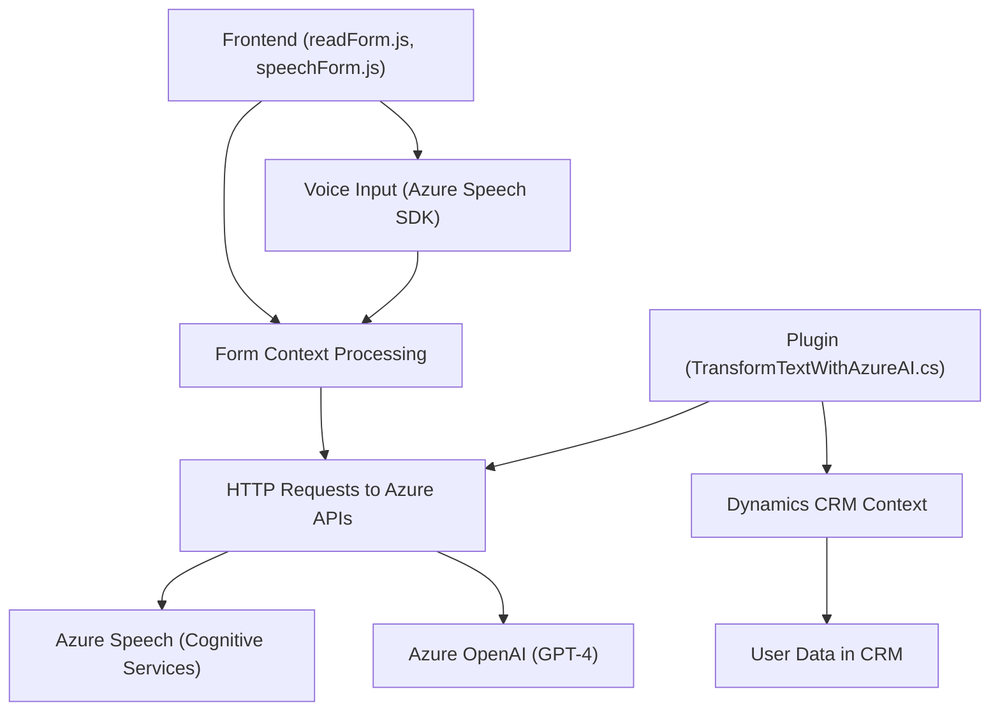

### Breve resumen técnico
Este repositorio contiene soluciones para la entrada, procesamiento y transformación de datos en forma de texto y voz, integrando servicios avanzados como Azure Speech SDK y Azure OpenAI API. La estructura incluye archivos JavaScript para el frontend y un plugin implementado en C# para integración con Dynamics CRM. Las funcionalidades principales incluyen extracción y síntesis de voz, reconocimiento de discurso y análisis basado en Inteligencia Artificial.

### Descripción de arquitectura
La arquitectura observada es una **n-capas**, donde cada capa maneja una responsabilidad específica:
- **Capa de presentación**: Los archivos `readForm.js` y `speechForm.js` gestionan la interacción del usuario en el frontend.
- **Capa de negocio**: El archivo `TransformTextWithAzureAI.cs` encapsula la lógica empresarial en el ecosistema Dynamics CRM y se comunica directamente con servicios de Azure para transformar datos.
- **Integración de servicios externos**: Las soluciones usan APIs de Azure (Speech y OpenAI) para ampliar funcionalidades mediante componentes en la nube.

### Tecnologías usadas
- **Frontend**:
  - JavaScript.
  - Azure Speech SDK.
- **Backend/Plugin**:
  - C# (.NET Framework para Dynamics CRM).
  - Azure OpenAI API.
  - Newtonsoft.Json para manipulación de JSON en C#.
- **APIs Externas**:
  - Azure Cognitive Services Speech SDK.
  - Azure OpenAI (GPT-4).
  - Microsoft Dynamics API (para manipulación de datos).

### Patrones identificados
1. **Separación de preocupaciones**: Lógica ordenada en funciones específicas tanto en el frontend como el backend.
2. **Carga dinámica de recursos**: El SDK de Azure Speech se carga sólo cuando es necesario en tiempo de ejecución.
3. **Integración con servicios externos**: Uso de APIs como Azure Speech y OpenAI para extender capacidades en el frontend y backend.
4. **Plugin Pattern**: Uso del patrón de integración de plugins en un contexto de servicio (Dynamics CRM).
5. **Modularidad**: Funciones y clases independientes que facilitan mantenimiento y escalabilidad.

### Diagrama Mermaid (válido para GitHub)

### Conclusión final
Este repositorio implementa una solución híbrida entre frontend y backend, apoyándose en APIs de Azure para ofrecer funcionalidades avanzadas de voz y análisis de datos estructurados. La arquitectura sigue un patrón **n-capas**, destacándose la integración modular con múltiples servicios de Azure y el uso de plugins para ampliar capacidades de Dynamics CRM. La solución es extensible y facilita la incorporación de nuevos servicios o módulos.