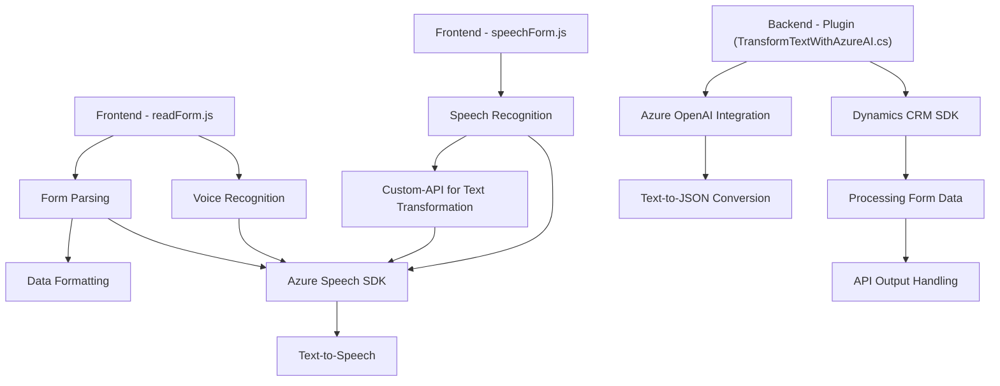

### Breve resumen técnico

El repositorio contiene tres archivos principales que implementan funcionalidades relacionadas con voz, procesamiento de formularios y transformación de texto usando servicios de Azure (Speech SDK, OpenAI). Estos archivos demuestran soluciones basadas en integración con APIs externas y trabajo en el ecosistema de Microsoft Dynamics 365 CRM. Los componentes están enfocados en la síntesis y reconocimiento de voz, transcripción asistida y transformación de datos mediante IA.

---

### Descripción de arquitectura

La arquitectura general es modular con componentes organizados en funciones y clases separadas según su propósito. La solución parece orientada a servicios (SOA), donde cada componente cumple una tarea en el ecosistema de Microsoft Dynamics CRM.

1. **Arquitectura del frontend:**
    - El frontend utiliza JavaScript y DOM API para procesar formularios visuales y realizar reconocimiento de voz con integración del servicio Azure Speech SDK.
    - Los componentes del frontend muestran una arquitectura basada en varias capas lógicas:
        - **Form Parsing**: Procesa datos visibles en el formulario.
        - **Voice Recognition/Speech Synthesis**: Maneja entrada y síntesis de voz vía SDK externo.
        - **API Integration**: Llama a APIs personalizadas para procesamiento avanzado.

2. **Backend (Plugin en Dynamics CRM):**
    - Este componente sigue el **Plugin Pattern**, integrándose con Microsoft Dynamics CRM mediante el SDK oficial de Dynamics.
    - La lógica interactúa con el servicio de Azure OpenAI (REST API) para transformar texto en estructuras JSON, encapsulando la funcionalidad en métodos internos.
    - Arquitectura basada en capa, similar a patrón hexagonal en algunos aspectos, usando puertas de enlace para interactuar con servicios externos.

---

### Tecnologías usadas

1. **Frontend**:
    - **JavaScript**: Lenguaje principal para la lógica del cliente.
    - **Azure Speech SDK**: Servicios de síntesis y reconocimiento de voz.
    - **DOM API**: Manipulación dinámica del HTML para cargar scripts y trabajar con formularios.

2. **Backend**:
    - **Microsoft Dynamics CRM SDK**: Framework de integración específico.
    - **Azure OpenAI**: Utilizado para procesamiento de texto en el plugin.
    - **System.Net.Http**: Comunicación REST para servicios externos.
    - **System.Text.Json** o **Newtonsoft.Json**: Para manipulación de JSON.

3. **Patrones arquitectónicos**:
    - **Plugin Pattern**: Para la implementación del componente en Dynamics CRM.
    - **Service Integration**: Integración directa con APIs externas (Azure Speech SDK y OpenAI).
    - **Delegación y Modularidad**: Separación lógica de funciones independientes.

---

### Diagrama **Mermaid** válido para GitHub:

---

### Conclusión Final

La solución combinada apunta a una integración exitosa entre un sistema CRM (Dynamics 365), servicios de voz y procesamiento de texto asistido por IA. Su arquitectura modular y orientada a servicios permite mantener una clara separación de responsabilidades: desde la interacción con el usuario en el frontend, hasta la manipulación de datos y servicios IA en el backend. Esto ejemplifica una solución escalable y extensible, aunque depende significativamente de Azure (*Speech SDK* y *OpenAI*) y el ecosistema de Dynamics CRM, lo que presupone cierto nivel de costos por licencias y servicios.