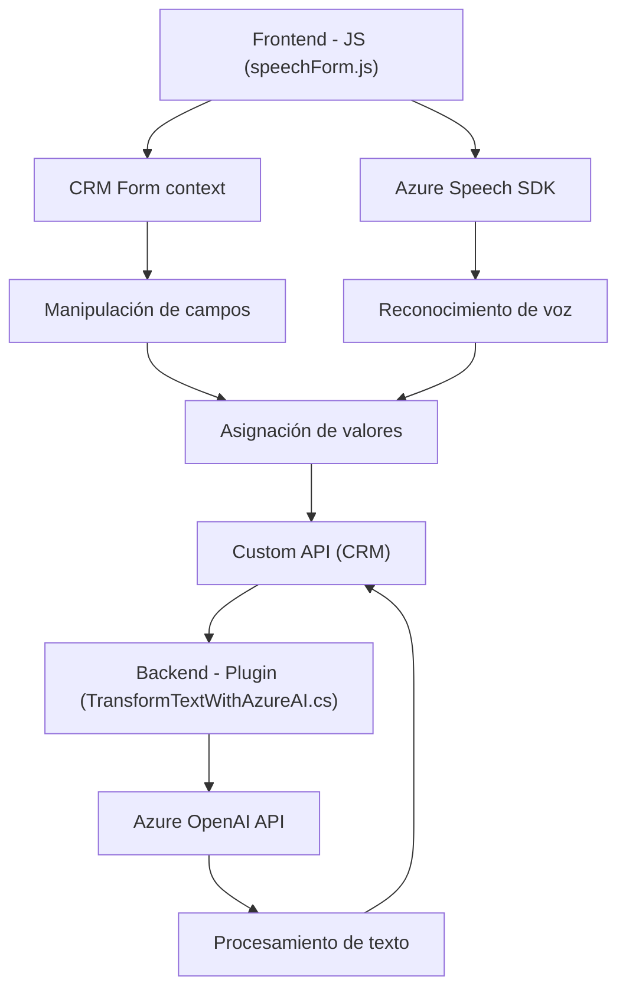

### Resumen técnico:
Se analiza un sistema de reconocimiento de voz y síntesis de texto integrado con formularios en un CRM (probablemente Dynamics CRM). Este sistema utiliza patrones arquitectónicos modernos, tecnologías como **Azure Speech SDK** y **Azure OpenAI**, y plugins acoplados al CRM. La solución incluye tanto componentes frontend como backend que interactúan para habilitar la entrada de voz, análisis de texto y generación de respuestas dinámicas.

---

### Descripción de arquitectura:
El sistema se basa en un **modelo de arquitectura de capas**, donde diferentes componentes manejan responsabilidades específicas:
- **Frontend**: Usa **JavaScript** para integrar la interacción con formularios y reconocer o sintetizar voz.
- **Backend Plugin**: Un plugin en C# implementa funciones específicas para manipular texto mediante **Azure OpenAI API**.
- **Servicios externos**: Dependencia directa del SDK de Azure Speech y la API de Azure OpenAI.
  
El diseño muestra características como dinamismo en la carga de dependencias, procesamiento basado en eventos, integración API y modularidad.

---

### Tecnologías usadas:
1. **JavaScript Frontend**:
   - **Azure Speech SDK**: Reconocimiento y síntesis de voz.
   - **Promesas/asincronía**: Flujo no bloqueante.
   - **CRM Form context**: Manipulación directa de formularios de Dynamics CRM.
   
2. **Backend Plugin (C#)**:
   - **Microsoft Dynamics CRM SDK**: Extensibilidad del CRM.
   - **Azure OpenAI API**: Procesamiento avanzado de texto.
   - **HTTP Client**: Integración API/solicitudes REST.
   - **Newtonsoft.Json y System.Text.Json**: Manipulación de JSON.

---

### Dependencias o componentes externos presentes:
1. SDK de Azure Speech.
2. Azure OpenAI API (GPT-4o).
3. Microsoft Dynamics CRM SDK.
4. Bibliotecas para JSON (Newtonsoft y System.Text).
5. Servicios del navegador como carga dinámica de SDK.
6. Custom APIs (de Dynamics CRM).

---

### Diagrama **Mermaid** válido en GitHub:

---

### Conclusión final:
El sistema es un **conjunto de capas integradas** centrado en la interacción con formularios en un CRM mediante reconocimiento de voz y análisis de texto. Se utiliza una mezcla de tecnologías frontend y backend junto a APIs externas que optimizan el flujo y procesamiento de datos. La arquitectura está bien diseñada para ser extensible, aunque implica alta dependencia en servicios de Azure y el SDK de Dynamics CRM. Ideal para entornos corporativos donde el CRM gestiona operaciones sensibles o automatizadas.