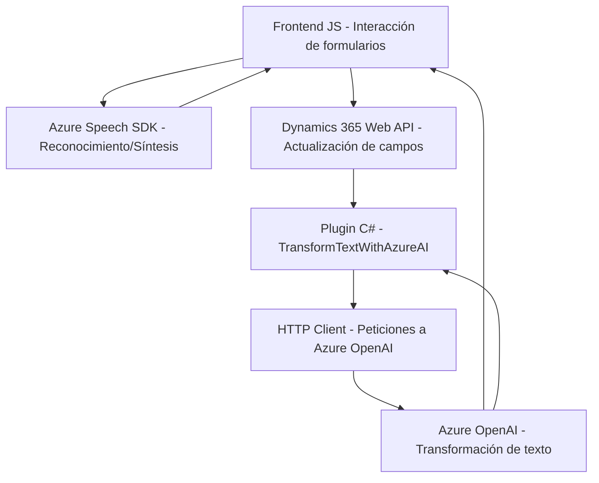

### Breve resumen técnico

El repositorio integra tecnologías de reconocimiento y síntesis de voz mediante **Azure Speech SDK**, además de procesamiento avanzado de texto por medio de **Azure OpenAI**. Está diseñado para operar en un entorno **Dynamics 365**, donde las capacidades de IA se utilizan para mapear campos interactivos en formularios y aplicar transformaciones personalizadas.

### Descripción de arquitectura

El diseño del sistema se puede categorizar como **n capas**, donde las funciones se dividen para manejar diferentes responsabilidades:
1. **Capa de presentación**: Compuesta principalmente por el frontend basado en JavaScript que gestiona la interacción con el usuario en los formularios web y el reconocimiento de voz.
2. **Capa de aplicación**: Gestiona operaciones como la interacción con APIs externas (Azure Speech, Dynamics 365 Web API, Azure OpenAI) y el mapeo dinámico de campos en formularios.
3. **Capa de procesamiento e integración**: Incluye el plugin C# (`TransformTextWithAzureAI`), que actúa como un servicio que resuelve solicitudes asincrónicas en Dynamics, comunicándose con el servicio Azure OpenAI y devolviendo contenido formateado.

El diseño muestra características de modulación y uso de arquitecturas basadas en **eventos**, con patrones como **Dependency Injection** y **programación asincrónica** fuertemente implementadas.

### Tecnologías usadas
- **Javascript/ES6**:
  - Lógica de frontend basada en funciones internas de los formularios y procesamiento de formularios interactivos en Dynamics.
- **Azure Speech SDK**:
  - Reconocimiento de voz y síntesis de texto en tiempo real.
- **Dynamics 365 Web API**: 
  - Interacción directa con formularios y el contexto del CRM para integración de datos.
- **Azure OpenAI**:
  - Procesamiento avanzado de texto con IA y generación de texto estructurado.
- **C# / Dynamics CRM SDK**:
  - Implementación de plugin personalizado que interactúa con el CRM y el servicio Azure OpenAI.
- **Patrones usados**:
  - **Plugin Pattern** en Dynamics para la clase principal del plugin.
  - **Dependency Injection** para la transmisión del contexto de ejecución en JavaScript.
  - **Asynchronous Programming** con Promesas (`async/await`) y métodos estáticos en C#.
  - **Gestión dinámica de dependencias externas**, como las librerías cargadas desde URL específicas.

### Diagrama Mermaid

### Conclusión final
El sistema está diseñado como una solución orientada a la integración cognitiva con aplicaciones CRM en Dynamics 365. La arquitectura de **n capas** del proyecto asegura modularidad y separación de las responsabilidades entre frontend, lógica de negocio y servicios externos. Además, la utilización de tecnologías avanzadas como **Azure Speech SDK** y **Azure OpenAI** subraya el enfoque en la modernización y automatización de procesos empresariales.