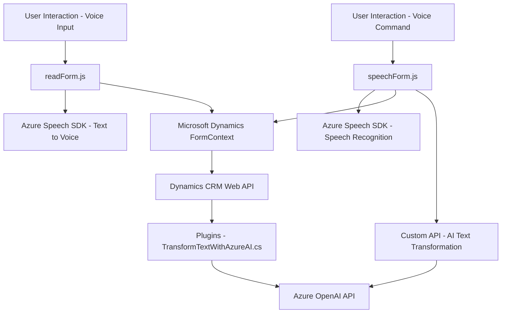

### Breve resumen técnico
El repositorio parece tener como objetivo la integración de módulos de reconocimiento de voz, síntesis de voz y procesamiento basado en inteligencia artificial con formularios en **Microsoft Dynamics 365 CRM**. Se basan en el uso de librerías como **Azure Speech SDK** para servicios de voz y **Azure OpenAI Service** para procesamiento avanzado de texto con IA. 

Los archivos del repositorio están organizados en tres secciones:
1. **Frontend/JS/readForm.js**: Responsables del reconocimiento de texto en formularios y síntesis de voz.
2. **Frontend/JS/speechForm.js**: Manejo de comandos por voz para manipular formularios de Dynamics más comunicación con APIs personalizadas para IA.
3. **Plugins/TransformTextWithAzureAI.cs**: Plugin de Dynamics CRM basado en C#, diseñado para integrar el servicio Azure OpenAI.

---

### Descripción de arquitectura
La solución sigue una **arquitectura n capas** y combina elementos de:
1. **Frontend (código JavaScript)**: 
   - Encargado de la comunicación directa con el usuario mediante interacciones por voz y manipulación de formularios en la interfaz.
   - Uso dinámico del **Azure Speech SDK** para manipulación y reconocimiento de voz.
   - Lógica especializada con patrones como Mediator para la interacción de APIs externas.

2. **Backend (plugin)**: 
   - Añade capacidades extendidas al sistema CRM mediante la implementación del modelo **plugin de Dynamics**.
   - Realiza integración con servicios externos (Azure OpenAI Service) y usa métodos asíncronos para llamadas RESTful.
   - Implementa procesamiento de negocio según entradas de datos entregadas por usuarios a través de lógica de formularios.

La arquitectura resulta ser un híbrido entre **n capas** (Frontend/Backend/Integración con servicios externos) y **orientada a eventos**, ya que las funciones están invocadas bajo ciertas condiciones en el contexto del CRM (como eventos que se ejecutan con el cambio de estado de un formulario o una acción de usuario).

---

### Tecnologías usadas
1. **Frontend**:
   - **JavaScript**: Lenguaje principal para manipulación del DOM, integración con SDKs y APIs.
   - **Azure Speech SDK**: Para capacidades de voz (síntesis, reconocimiento).
   - **Dynamics CRM Context API** (`formContext`): Acceso al modelo de datos del CRM y manipulación de atributos en formularios.

2. **Backend**:
   - **C# / .NET**: Lenguaje y framework utilizados para el plugin en Dynamics CRM.
   - **Dynamics SDK (Microsoft.Xrm.Sdk)**: Entrada y salida de datos del CRM.
   - **Azure OpenAI Service (GPT)**: Procesamiento y transformación de texto basado en inteligencia artificial.
   - **JSON Manipulation (Newtonsoft.Json.Linq)**: Serialización y deserialización de objetos.

3. **Servicios externos**:
   - Carga dinámica de librerías remotas a través de URLs (e.g., Azure Speech SDK).
   - Llamadas HTTP para integrar servicios en la nube (como él Azure OpenAI Service y Dynamics Web API).

---

### Diagrama Mermaid válido para GitHub Markdown

---

### Conclusión final
La solución es un conjunto modular que permite enriquecer formularios en Microsoft Dynamics CRM con funcionalidades avanzadas de voz e inteligencia artificial. La arquitectura combina **n capas** con integración de servicios externos (Azure Speech SDK y Azure OpenAI Service), cumpliendo un enfoque extensible y escalable ideal para escenarios empresariales. Además, la incorporación de la arquitectura de plugins para Dynamics CRM permite ampliar la funcionalidad del sistema sin modificar sus fundamentos.