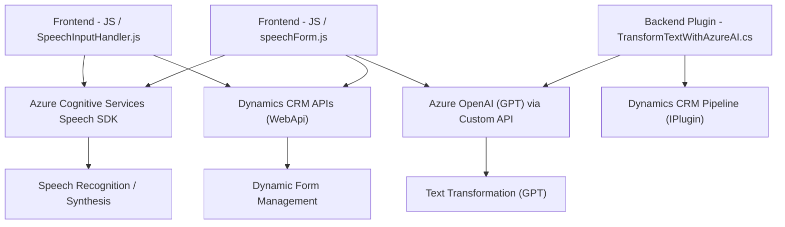

## Breve Resumen Técnico

El repositorio incluye varios archivos que implementan funcionalidades en una solución que combina frontend, plugins para Microsoft Dynamics CRM y servicios de Azure AI. Los principales componentes se centran en el **reconocimiento y síntesis de voz**, así como en la transformación de datos mediante inteligencia artificial conectada a **Azure OpenAI**.

---

### **Descripción de la arquitectura**
La arquitectura de la solución presenta una combinación de **n capas** y **event-driven architecture**:
1. **Frontend** (Directorio: `FRONTEND`): Implementación de lógica de cliente utilizando JavaScript para interactuar con el usuario y procesar **voz y texto** en formularios. Utiliza abordajes modulares y asincrónicos para la integración con SDKs y APIs.
2. **Backend (Plugins)** (Directorio: `Plugins`): Implementación de lógica empresarial mediante el **plugin framework de Microsoft Dynamics CRM**. Utiliza dependencias de Microsoft SDK y se conecta al servicio de Azure OpenAI para el procesamiento de datos.
3. **Servicios Externos**: Se observa una clara **arquitectura orientada a servicios (SOA)**, integrando múltiples APIs de Azure en diferentes capas del sistema.

---

### **Tecnologías Usadas**
1. **Frontend:**
   - **JavaScript**: Implementación de lógica para captura de voz, procesamiento de datos y actualización de formularios.
   - **Azure Cognitive Services Speech SDK**: Utilizado para la síntesis y el reconocimiento de voz.
   - **Dynamics CRM APIs (WebApi)**: Integración con la API de Dynamics para manipular formularios y datos.

2. **Backend:**
   - **Microsoft Dynamics CRM SDK (`IPlugin`)**: Proporciona el contexto para crear y ejecutar plugins dentro del pipeline de CRM.
   - **Azure OpenAI**: Utiliza GPT para transformar texto según reglas predeterminadas con integración vía REST.

3. **Dependencias de procesamiento:**
   - **System.Text.Json** (para manejo de JSON en backend).
   - **Newtonsoft.Json** (alternativa para objetos JSON).

4. **Servicios de Azure observados:**
   - Azure Cognitive Services Speech SDK.
   - Azure OpenAI (GPT-4).

---

### **Patrones de Diseño Observados**
1. **Event-driven architecture**: En el frontend, se observa un patrón orientado a eventos para el procesamiento de voz y la respuesta del SDK.
2. **Proxy Pattern**: El plugin actúa como un intermediario entre Microsoft Dynamics CRM y Azure OpenAI.
3. **Single Responsibility Principle**: Cada función/método tiene una tarea específica y bien definida.
4. **Command Pattern**: En el frontend, las acciones como síntesis de voz, procesamiento de formulario o actualizaciones están encapsuladas en comandos separados.

---

### **Diagrama Mermaid**

---

### **Conclusión Final**

La solución presentada es una **arquitectura híbrida multicapas** que combina un **frontend en JavaScript** con capacidades de reconocimiento de voz (Azure Speech SDK) y un **backend orientado a servicios** en Dynamics CRM. La integración con Azure OpenAI permite añadir funcionalidades avanzadas basadas en IA.

#### Ventajas:
- Modularidad: Cada componente tiene una responsabilidad definida, facilitando el mantenimiento y escalado.
- Uso de servicios de Azure: Mejora la funcionalidad y reduce la carga de implementación de algoritmos complejos.
- Accesibilidad mejorada mediante la síntesis de voz en el frontend.

#### Desafíos:
- Dependencia de servicios externos (Azure), que requiere alta disponibilidad de dichos servicios.
- Complejidad en la integración entre las capas (frontend, backend y servicios externos).

Esta arquitectura puede ser ideal para soluciones basadas en CRM corporativo que requieran interacción avanzada con los usuarios utilizando voz e IA. Sin embargo, es crucial implementar políticas de reintento y manejo de errores en los puntos de integración de las APIs externas.