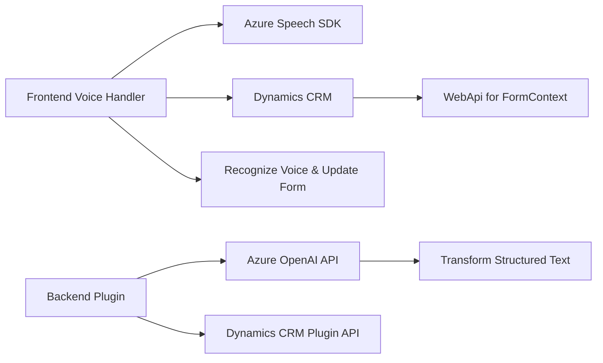

### Breve Resumen Técnico
Este repositorio parece estar diseñado para una solución orientada al procesamiento y enriquecimiento de datos, aplicando reconocimiento de voz, síntesis de voz y una integración avanzada con Azure AI (OpenAI). Está dividido entre la capa de **frontend** (JS para reconocimiento/lectura de voz) y una capa de **backend** (plugin en .NET para integración con Dynamics CRM y OpenAI). La solución apunta a mejorar la experiencia de usuario en sistemas como CRM a través de interacción por voz y manipulación inteligente de datos.

---

### Descripción de la Arquitectura
La solución tiene una arquitectura **híbrida orientada a servicios**:
1. En el **frontend**, se ejecuta lógica para interactuar directamente con APIs y SDKs externos, como Azure Speech SDK, junto con manipulación de formularios CRM.
2. El backend implementa un enfoque basado en **plugins** integrados a Dynamics CRM (`IPlugin`), lo que permite la transformación de datos de manera estructurada mediante Azure OpenAI.

Los componentes están organizados de manera modular, manteniendo separación de responsabilidades:
- El manejo del SDK de Azure Speech, tanto para reconocimiento como para síntesis de voz, se realiza en archivos separados en el frontend.
- El plugin en .NET utiliza una arquitectura de integración frontal con Dynamics CRM y Azure OpenAI, facilitando una interacción dinámica con los datos del sistema.

Esta solución puede clasificarse como una **arquitectura N-capas**, con una capa de presentación (VoiceInputHandler.js, TransformTextWithAzureAI.cs), capa de aplicación (lógica del reconocimiento y manipulación de textos), y capa de servicios (Consumption of Azure Speech SDK & OpenAI APIs).

---

### Tecnologías Usadas
1. **Frontend**
   - **JavaScript**: Para manejar formularios, integrar reconocimiento de voz (Azure Speech SDK), y actualizar datos dinámicamente en el lado del cliente.
   - **Azure Speech SDK**: Procesamiento de síntesis de voz y reconocimiento de voz.
   - **Dynamics CRM API**: Interacción con los formularios de Dynamics CRM.

2. **Backend**
   - **.NET (C#)**: Programación del plugin para Dynamics CRM.
   - **Azure OpenAI API**: Transformación avanzada de texto estructurado.
   - **Dynamics CRM SDK**: Para manipulación de datos organizacionales y ejecución de lógica empresarial.

3. **Patrones y Principios**
   - Modularidad (cada archivo enfocado en una tarea específica).
   - SOA (Service-Oriented Architecture), haciendo uso extensivo de APIs externas (Azure Speech SDK, Azure OpenAI API).
   - Asincronía en JavaScript y llamada a servicios externos.
   - Arquitectura de plugins para Dynamics CRM (interfaz `IPlugin`).

---

### Diagrama Mermaid
El siguiente diagrama representa la estructura lógica y la interacción entre los componentes del sistema, mostrando cómo las capas (frontend y backend) interactúan con servicios externos y el sistema Dynamics CRM.

---

### Conclusión Final
Esta solución es una integración entre un sistema CRM y servicios avanzados de inteligencia artificial y reconocimiento/síntesis de voz, diseñada con modularidad y separación de responsabilidades. Las tecnologías y patrones empleados son aptos para un entorno empresarial en el que la accesibilidad y eficiencia, mediante inteligencia artificial, juegan un papel clave.

- El **frontend** utiliza JavaScript con Azure Speech SDK para enriquecer formularios mediante voz.
- El **backend** en .NET implementa plugins que transforman datos con Azure OpenAI dentro del contexto de Dynamics CRM.

Este sistema puede seguir escalándose mediante la adición de más funcionalidad basada en servicios de Azure, mejorando interacción y capacidades automatizadas en el CRM. Sin embargo, la seguridad (como manejo de claves API) y la gestión de errores podrían ser áreas críticas para mejorar.