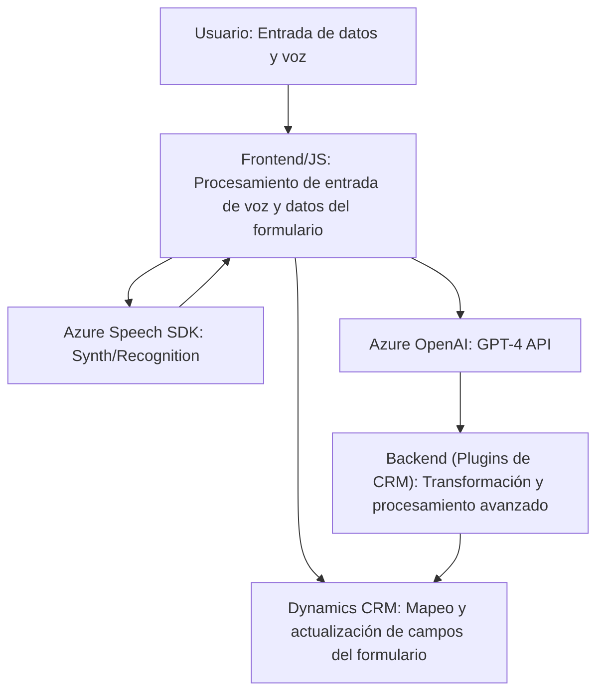

### Breve resumen técnico
El repositorio integra múltiples componentes para la interacción con formularios en **Microsoft Dynamics CRM**, utilizando tecnologías avanzadas como el **Azure Speech SDK** y **Azure OpenAI**. Está diseñado para permitir la transformación automática del texto y la interacción avanzada mediante entrada de voz y generación de texto sintetizado.

---

### **Descripción de arquitectura**
La arquitectura se basa en una estructura de **n capas** adaptada a un ecosistema de **Microsoft Dynamics CRM**, donde cada componente tiene un rol definido:
1. **Frontend (JS):** Permite el procesamiento de datos en tiempo real mediante funcionalidades como entrada de voz (speech-to-text) y síntesis de voz (text-to-speech).
2. **Backend (C# Plugin):** Extiende las funciones de Dynamics CRM, utilizando servicios externos como Azure OpenAI para transformar texto estructurado.
3. **Integración con APIs:** Uso extensivo de APIs externas (Azure Speech y OpenAI) para proporcionar funcionalidades enriquecidas y procesamiento de datos.

---

### **Tecnologías usadas**
1. **Frontend (JS):**
   - **Principal tecnología:** JavaScript.
   - **Servicios:** Azure Speech SDK para reconocimiento y síntesis de voz.
   - **Framework:** Dynamics CRM JavaScript SDK.
   - **Patrones:** Event-oriented, Modular Functions, API-driven.
   
2. **Backend (C# Plugin):**
   - **Framework:** Microsoft Dynamics CRM SDK.
   - **Servicios:** Azure OpenAI API para generación de texto estructurado.
   - **Librerías:** Newtonsoft.Json para manipulación de JSON, System.Net.Http para solicitudes HTTP.
   - **Patrón de diseño:** Plugin Pattern, Microservicios vía API Gateway.

---

### **Dependencias o componentes externos**
1. **Azure Speech SDK:** Para la síntesis y reconocimiento de voz. Descargado dinámicamente en el frontend mediante `ensureSpeechSDKLoaded`.
2. **Azure OpenAI API (GPT-4):** Servicio externo que recibe texto y devuelve respuestas estructuradas usando inteligencia artificial.
3. **Dynamics CRM SDK:** Permite manipulación de datos del formulario y mapeo entre campos CRM.
4. **Frameworks y librerías:**
   - **Newtonsoft.Json:** Serialización/deserialización JSON en plugins.
   - **System.Net.Http:** Llamadas HTTP al servicio OpenAI.
   - **System.Text.Json:** Alternativa para JSON manipulación en plugins.

---

### **Diagrama Mermaid**

---

### **Conclusión final**
El repositorio implementa una solución robusta y moderna para extender las capacidades de **Microsoft Dynamics CRM** mediante la integración de servicios avanzados como **Azure Speech** y **Azure OpenAI**. Este sistema tiene un diseño modular basado en **n capas**, donde tanto el frontend en JavaScript como los plugins backend en C# interactúan con APIs externas para completar la funcionalidad deseada. La arquitectura está bien estructurada para satisfacer requisitos de extensibilidad en un entorno empresarial.