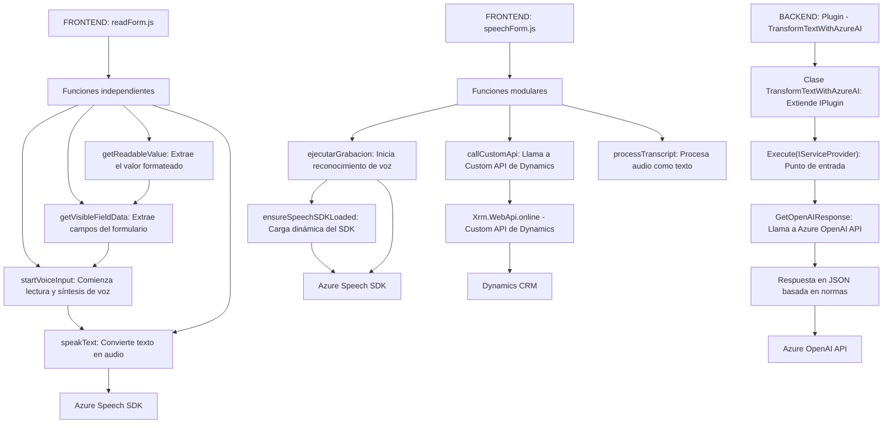

### **Breve resumen técnico:**
El repositorio pertenece a un sistema desarrollado para integración con Dynamics 365 CRM, enfocado en funcionalidades relacionadas con formulación de datos, entrada/salida de voz y procesamiento de texto mediante APIs de servicios de Azure, como Azure Speech SDK y Azure OpenAI. Los archivos muestran una combinación de arquitecturas y patrones en ambos frontends (readForm.js/speechForm.js) y plugins backend (TransformTextWithAzureAI.cs).

---

### **Descripción de arquitectura:**
1. **Tipo de Solución:**  
   - Combina diferentes componentes para una integración de **Microservicios** orientados a funcionalidades específicas:
     - **Frontend modular:** Scripts JavaScript para procesamiento de formularios y entrada/salida de voz.
     - **Backend CRM plugin:** Regula la interacción entre Dynamics 365 y Azure OpenAI.

2. **Patrones de Arquitectura:**  
   - En **frontend**, utiliza una arquitectura de **funciones modulares** a nivel de archivo, donde cada funcionalidad está separada en métodos independientes que colaboran con un SDK externo (Azure Speech). Se incluye programación asincrónica y un flujo basado en eventos o callbacks para carga dinámica del SDK.
   - **Backend** emplea arquitecturas basadas en eventos y servicios con interacción directa de los plugins con Dynamics CRM y Azure OpenAI API. Esto permite una integración desacoplada entre servicios, proponiendo un enfoque de microservicios.

3. **Dependencias o Componentes Externos:**
   - **Azure Speech SDK:** Para integrar funcionalidad de reconocimiento y síntesis de voz en frontend.
   - **Azure OpenAI API (GPT-4):** Para procesar texto y transformarlo en un formato estructurado como JSON en el plugin de CRM.
   - **Dynamics 365 SDK:** Para la interacción del backend con los datos del CRM mediante el framework estándar del SDK (`Microsoft.Xrm.Sdk`).
   - **Custom API de Dynamics:** Manejada mediante el Web API del CRM, usada especialmente en el script `speechForm.js`.

---

### **Tecnologías Usadas:**
1. **Frontend:**
   - **JavaScript:** Lenguaje base junto con programación estructurada y event-driven.
   - **Azure Speech SDK:** Implementación de entradas y salidas de voz (sintetización/lectura y reconocimiento).
   - **Dynamics 365 APIs:** Para manipular datos de formularios y llamadas a Custom APIs.
   
2. **Backend Plugin:**
   - **C#** y .NET Framework: Lenguaje y plataforma base.
   - **Microsoft Dynamics CRM SDK:** Gestión de datos empresariales en CRM.
   - **Azure OpenAI API (GPT-4):** API avanzada de procesamiento de lenguaje natural para transformar texto en JSON.
   - **Newtonsoft.Json.Linq:** Librería popular para manejar JSON en .NET.
   - **HttpClient (System.Net.Http):** Nacionalización con un servicio externo (Azure API).

---

### **Diagrama Mermaid:**

---

### **Conclusión final:**
La solución es una arquitectura híbrida que combina **componentes frontend** para interacción con el usuario y datos del formulario mediante reconocimiento o síntesis de voz, y un **plugin backend** que integra procesamiento con inteligencia artificial bajo Azure OpenAI. Adopta un modelo de **microservicio modular** mediante APIs y servicios externos. La tecnología utilizada, incluidos SDKs de Microsoft Azure, proporciona una experiencia robusta y extensible para el ecosistema de Dynamics 365, aunque puede beneficiarse de mejoras en modularización, seguimiento de errores y pruebas integrales.