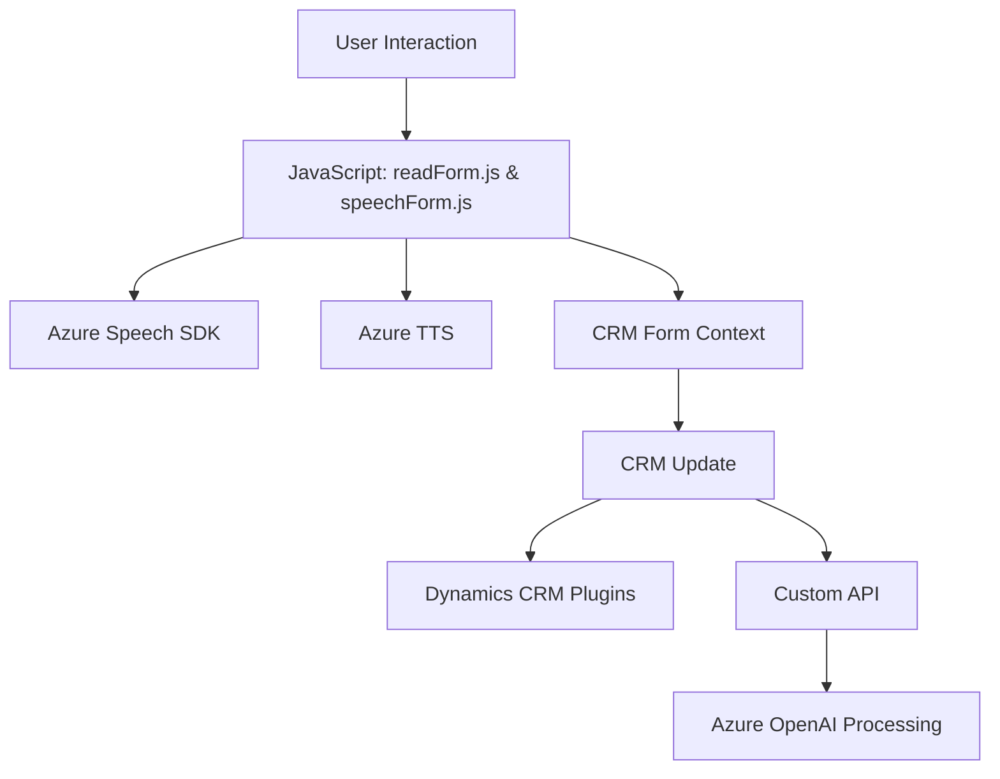

### Breve Resumen Técnico

El repositorio contiene tres archivos principales, enfocados en la integración de reconocimiento de voz, procesamiento de texto mediante inteligencia artificial, y actualización dinámica de datos en un formulario CRM utilizando servicios de Azure. Los archivos combinan tecnologías front-end (JavaScript) con extensiones back-end como plugins .NET para Dynamics CRM, resultando en una solución integral orientada a la interacción y procesamiento de datos.

---

### Descripción de Arquitectura

La solución se caracteriza por una arquitectura híbrida que combina aspectos de **n capas** y **Service-Oriented Architecture (SOA)**. 

- **Frontend**: Estructurado modularmente con funciones que procesan datos de formularios y los envían a servicios externos (Azure Speech y Azure AI). Utiliza JavaScript para interacción con el usuario y formularios, que es probablemente una aplicación basada en navegador.
- **Backend**: Implementado como una extensión de Dynamics CRM mediante plugins. Integrado con servicios de Azure (Speech SDK y OpenAI) para ejecuciones basadas en eventos (E.g., al capturar datos de voz o transformar texto).
- **Dependencia con microservicios externos**: Se delegan tareas específicas como TTS (Text-to-Speech) o procesamiento basado en inteligencia artificial.

---

### Tecnologías Usadas

#### **Frontend**
1. **JavaScript**: Core para desarrollo de las funciones de voz y visualización.
2. **Azure Speech SDK**: Para el reconocimiento de voz (transcripción) y síntesis (TTS: Texto-a-Voz).
3. **CRM**: Probablemente Microsoft Dynamics, dado el uso del `executionContext` y la referencia al CRM.

#### **Backend**
1. **.NET Framework**: Para la extensión de Dynamics CRM mediante plugins (`TransformTextWithAzureAI.cs`).
2. **Microsoft.Xrm.Sdk**: Librería oficial para la extensión de Dynamics CRM.
3. **Azure OpenAI API**: Para el procesamiento avanzado de texto y generación de respuestas en formato JSON.
4. **System.Net.Http & Newtonsoft.Json**: Para manejar solicitudes HTTP y procesar datos JSON.

---

### Dependencias y Componentes Externos Presentes
1. **APIs y SDKs de Azure**:
   - **Azure Speech SDK** para reconocimiento de voz y síntesis TTS.
   - **Azure OpenAI API** para procesamiento de texto con inteligencia artificial.
   - **Cloud Services** para configuración de claves y regiones.
   
2. **Microsoft CRM Dynamics**:
   - Cliente e integración con formularios personalizables.
   - Dependencia del API `Xrm.WebApi` para modificación de formularios desde el front-end y back-end.

3. **Browser API**: Para cargar dinámicamente scripts y manejar recursos con JavaScript.

4. **Serialization**:
   - `Newtonsoft.Json.Linq` y `System.Text.Json` para trabajar con objetos JSON en el plugin .NET.

5. **HTTP Requests**:
   - Uso del espacio de nombres `System.Net.Http` para consumir servicios RESTful de Azure OpenAI y Speech.

---

### Diagrama Mermaid Válido para GitHub

---

### Conclusión Final

Este repositorio representa una solución basada en reconocimiento de voz, síntesis de texto a voz, y procesamiento avanzado de texto mediante inteligencia artificial, integrada adaptativamente dentro de un entorno de Dynamics CRM. Su arquitectura combina modularidad en el front-end, extensibilidad en el back-end mediante plugins, e integración con servicios externos (Azure Speech SDK y OpenAI). Es ideal para escenarios de interacción dinámica con datos y formularios como los sistemas CRM. Sin embargo, algunas consideraciones de seguridad (como el manejo de claves API) y eficiencia podrían ser mejorados.