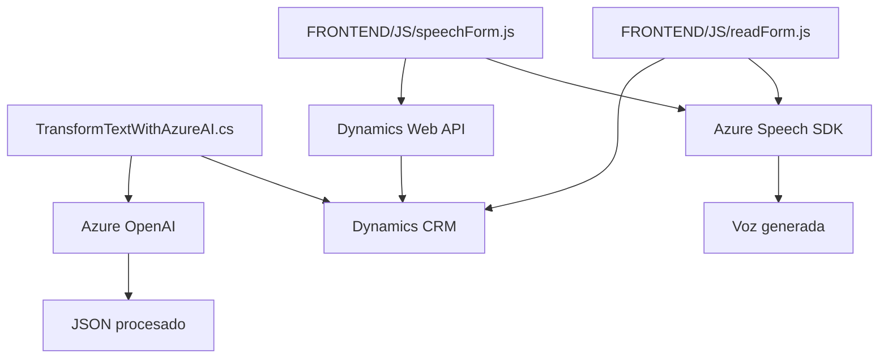

### Breve resumen técnico
Este repositorio parece ser parte de una solución empresarial integrada con Microsoft Dynamics CRM que utiliza servicios de Microsoft Azure para la gestión de voz y transformación de texto. Combina **frontend dinámico en JavaScript**, procesamiento avanzado usando **Azure Speech SDK**, y extensiones via **plugins C#** para la plataforma Dynamics.

---

### Descripción de arquitectura
La arquitectura es una solución híbrida que combina:
1. **Capas de interacción frontend:** Scripts JS interactúan con formularios basados en Dynamics, manipulan datos y utilizan el SDK Azure Speech.
2. **Capas de negocio en el backend:** Plugins en C# se conectan con Dynamics CRM y utilizan servicios externos (Azure OpenAI) para lógica avanzada.
3. **Integración de servicios externos:** Delegación de tareas especializadas (voz: Azure Speech; transformación de texto: Azure OpenAI).

Incluye patrones de **eventos asíncronos**, dependencia de **microservicios externos** para funcionalidad específica y sigue parcialmente el modelo **n capas**, mezclándolo con elementos de **arquitectura basada en eventos/dispositivos**.

---

### Tecnologías usadas
1. **Frontend:**
   - **JavaScript:** Scripts dinámicos para interacción con formularios.
   - **Azure Speech SDK:** Reconocimiento y síntesis de voz.
   - **Dynamics Web API:** Manipulación de campos/entidades en formularios CRM.

2. **Backend:**
   - **C#/.NET Framework:** Plugins personalizados para Microsoft Dynamics CRM.
   - **Azure OpenAI (GPT):** Transformación textual mediante API HTTP.
   - **Microsoft.Xrm.Sdk:** Acceso CRM.
   - **Json libraries:** Manejo de estructuras JSON (`System.Text.Json`, `Newtonsoft.Json.Linq`).

3. **Patrones arquitectónicos:**
   - Modularidad funcional.
   - Uso de API externas (microservicios) como Azure Speech y OpenAI.
   - Carga dinámica de dependencias con SDK.
   - Plugins en arquitectura n capas.
   
---

### Diagrama Mermaid
Este diagrama muestra la interacción entre componentes de la solución (frontend, backend y externos).

---

### Conclusión final
La solución muestra una arquitectura híbrida que integra tecnologías de Microsoft en dos capas principales:
1. **Frontend dinámico y accesible:** Genera voz, analiza formularios y mejora la experiencia de usuario mediante accesibilidad.
2. **Backend personalizado con plugins:** Potenciado con IA (Azure OpenAI) para reglas avanzadas en Dynamics CRM.

Aunque el diseño es funcional, puede beneficiarse del uso de infraestructuras de configuración externa (e.g., gestión de claves para servicios) y separación de responsabilidades más clara en frontend/backend. Es una combinación efectiva de servicios locales y externos, contribuyendo a una solución con alta especialización en accesibilidad y procesamiento textual.