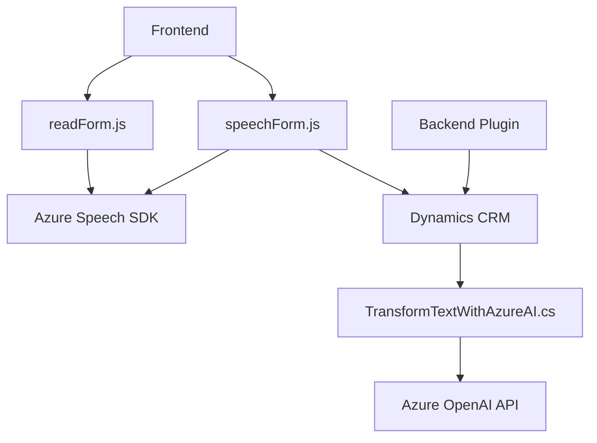

### Breve resumen técnico
El repositorio contiene componentes que implementan funcionalidades relacionadas con la interacción de formularios, entrada/salida por voz, y procesamiento de texto mediante tecnologías de Microsoft (Azure Speech SDK, Dynamics CRM, Azure OpenAI). Las soluciones están orientadas al frontend y servicios backend, con un enfoque en la integración entre diversas plataformas y APIs relacionadas con la nube.

### Descripción de arquitectura
- **Componentes principales**:
  1. **Frontend**:
     - `readForm.js` y `speechForm.js`: Scripts que utilizan el **Azure Speech SDK** para realizar síntesis y reconocimiento de voz. Interactúan con formularios y transforman datos en valores asignables a campos visibles.
  2. **Backend Plugin**:
     - `TransformTextWithAzureAI.cs`: Plugin instalado en Dynamics CRM que consume el servicio **Azure OpenAI** para transformar texto en JSON estructurado.
- **Arquitectura**: 
  - El diseño combina un frontend de capa modular interactuando con servicios externos, junto con un backend basado en un plugin de Dynamics CRM. Esto implica una **arquitectura distribuida** con funcionalidad de microservicios integrada mediante APIs externas.

### Tecnologías usadas
1. **Frontend**:
   - **JavaScript**: Para implementación de lógica y operaciones en el navegador.
   - **Azure Speech SDK**: Para síntesis y reconocimiento de voz.
   - **Xrm.WebApi**: Para interacción con datos del formulario en Dynamics CRM.
2. **Backend (Dynamics Plugin)**:
   - **C# (.NET Framework)**: Para creación del plugin utilizando la interfaz `IPlugin`.
   - **Microsoft.Xrm.Sdk**: Para interacción con Dynamics CRM.
   - **Newtonsoft.Json** y **System.Text.Json**: Para manejo de datos JSON.
   - **System.Net.Http**: Para llamadas HTTP a Azure OpenAI.

### Dependencias o componentes externos
1. **Azure Speech SDK**:
   - Utilizado tanto para la síntesis de voz como para el reconocimiento.
   - Cargado dinámicamente desde el navegador para la interacción directa.
2. **Azure OpenAI API**:
   - Utilizada en el plugin para procesar texto y transformarlo en formatos JSON.
3. **Dynamics CRM**:
   - Como plataforma base para el backend y estructura de formularios.
4. **Libraries**:
   - `Newtonsoft.Json` y `System.Text.Json` para manejar el intercambio de datos estructurados.

### Diagrama Mermaid

### Conclusión final
El sistema es una solución híbrida diseñada en torno a una arquitectura compuesta de dos capas principales: **frontend con capacidades interactivas (voz/formularios)** y **backend extensible basado en integración entre Dynamics CRM y servicios de Azure**. La interacción de componentes externos (Azure Speech SDK y OpenAI API) complementa las funcionalidades, permitiendo un diseño modular con enfoque en reutilización y alta capacidad de integración. Aunque la arquitectura puede ser descrita como distribuida, cada sección sigue patrones particulares de diseño como lógica encapsulada y adaptadores para simplificar la interacción entre APIs y tecnologías.