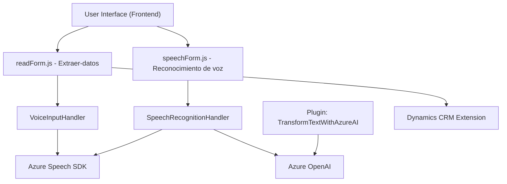

### Breve resumen técnico

El repositorio contiene tres componentes principales que trabajan en conjunto para resolver una solución de manejo de voz y texto estructurado, integrando reconocimiento de voz, síntesis de voz, y transformación de texto usando Azure Speech SDK y Azure OpenAI. Estos están implementados a través de scripts frontend y un plugin personalizado diseñado para Dynamics CRM.

---

### Descripción de arquitectura

**Arquitectura General**:
La solución puede clasificarse como una **aplicación híbrida de n capas**, donde las capas principales incluyen:
- **Frontend**: Scripts de JavaScript (`readForm.js` y `speechForm.js`) para manejar la experiencia de usuario y comunicación directa con Azure.
- **Backend**: Plugin en `.NET` (`TransformTextWithAzureAI.cs`) que se integra con Dynamics CRM ofreciendo funcionalidad avanzada como transformación de texto.
- **Servicios de terceros**: Comunicación con **Azure Speech SDK** y **Azure OpenAI** mediante integraciones RESTful.

**Patrones de diseño utilizados**:
1. **Modular**: Las funciones están claramente separadas para tareas específicas (reconocimiento de voz, síntesis, manejo de datos).
2. **SDK Wrapper**: Para encapsular funcionalidades relacionadas con Azure Speech SDK.
3. **Facade**: Simplificación de interacciones complejas con Speech SDK y Dynamics CRM.
4. **Interacción RESTful**: Integraciones con servicios de terceros (Azure OpenAI).
5. **Event-driven** y **Callback-oriented**: Uso de eventos y callbacks para flujo asincrónico en frontend.

---

### Tecnologías, frameworks y patrones utilizados

#### Tecnologías/frameworks:
1. **Azure Speech SDK**: Sintetización y reconocimiento de voz en tiempo real.
2. **Dynamics CRM Plugin (`Microsoft.Xrm.Sdk`)**: Backend extensible basado en .NET, integrado dentro del ecosistema Dynamics 365.
3. **Azure OpenAI**: Procesamiento avanzado del texto utilizando Inteligencia Artificial.
4. **JavaScript**: Para manipulación del DOM, carga dinámica de SDK, y procesamiento de formularios visibles.

#### Tecnologías auxiliares:
- **REST APIs**: Comunicaciones HTTP para consumir servicios externos.
- **JSON**: Serialización y deserialización de datos hacia/desde Azure OpenAI (con `System.Text.Json`).

#### Patrones utilizados:
- Modularización de funciones.
- Wrapper SDK.
- Arquitectura n capas con separación frontend/backends.
- Plugins en Dynamics CRM.
- Sistema de normas configurables para validación flexible.

---

### Diagrama Mermaid válido para GitHub

---

### Conclusión final

Esta solución implementa una arquitectura híbrida de n capas que combina un frontend avanzado con lógica de reconocimiento y síntesis de voz, un middleware basado en Dynamics CRM, y poderosos servicios externos como Azure Speech SDK y Azure OpenAI. Está diseñada con modularidad y extensibilidad en mente, permitiendo configurar y personalizar cada capa según las necesidades. Además, utiliza patrones comunes en SDK Wrappers y eventos asincrónicos para maximizar la eficiencia y el manejo de la lógica. Es ideal para aplicaciones que requieren interacción escrita, hablada, y transformaciones inteligentes en tiempo real.