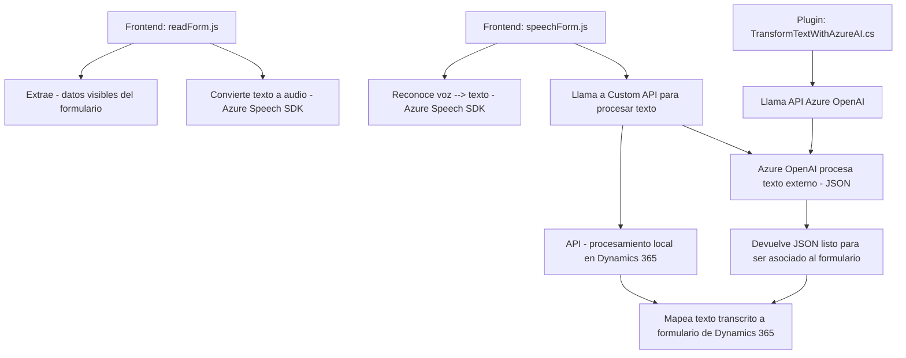

### Breve resumen técnico
El repositorio GitHub analizado consta de múltiples archivos que describen una solución para la interacción entre formularios dinámicos (aparentemente diseñados para Microsoft Dynamics 365) y servicios de inteligencia artificial y síntesis de voz en Azure. Los archivos están organizados en distintas carpetas relacionadas con funciones de frontend en JavaScript y un plugin en C#. La solución parece centrarse en integrar funciones de entrada y salida de datos, apoyándose en tecnología cloud como Azure Speech SDK y Azure OpenAI Services para procesar voz y/o texto.

---

### Descripción de la arquitectura
La solución implementada tiene características que sugieren una **arquitectura de microservicios basada en APIs**, especialmente por la interacción dinámica con Azure Cognitive Services y posiblemente con APIs personalizadas de Dynamics 365. No obstante, algunos módulos del frontend muestran elementos de una **arquitectura de capas** organizada (con roles definidos para captura de datos de formularios, procesamiento local/externo vía APIs y funciones de almacenamiento).

El uso del plugin para conectar con Azure OpenAI junto con otras API personalizadas sugiere una orientación hacia **componente-service architecture**. Las acciones se gestionan mediante módulos independientes con responsabilidades claramente definidas.

---

### Tecnologías usadas
1. **Lenguajes de programación**:
   - **JavaScript**: Desarrollo de lógica del frontend. Se interactúa con formularios en Dynamics 365.
   - **C#**: Desarrollo de plugin para Dynamics CRM y consumo de Azure OpenAI.

2. **Plataformas y servicios**:
   - **Microsoft Dynamics 365**:
     - Web API (`Xrm.WebApi`) para interacciones con entidades y formularios.
     - Plugins implementados para personalizar y extender las funcionalidades nativas.
   - **Azure Cognitive Services**:
     - Azure Speech SDK para sintetizar texto como audio y convertir voz a texto.
     - Azure OpenAI para transformación de texto en estructuras JSON.

3. **Dependencias y librerías**:
   - **Microsoft.Xrm.Sdk** y **Newtonsoft.Json** en C#.
   - HTTP Client (`System.Net.Http`) para llamadas API.
   - Microsoft Speech SDK cargado dinámicamente desde el navegador.

4. **Patrones y principios de arquitectura**:
   - **Modularización**: Los scripts y plugins están organizados por funcionalidad específica.
   - **Delegate Pattern**: Implementación en métodos que cargan dependencias externas como SDKs o envían callbacks.
   - **Plugin Pattern**: Cumple con las especificaciones para Dynamics 365, extendiendo capacidades mediante IPlugin.
   - **Carga dinámica de dependencias**: Capacidad de cargar servicios como Speech SDK en tiempo de ejecución para optimizar recursos.
   - **Decoupling con APIs externas**: Delegación de transformaciones avanzadas al servicio Azure OpenAI.

---

### Diagrama Mermaid válido para GitHub

---

### Conclusión final
El análisis del repositorio muestra que la solución es un sistema **orientado a servicios** diseñado para integrar capacidades de voz a texto y texto a voz con funcionalidades avanzadas de procesamiento de datos estructurados en un contexto de CRM. La arquitectura combina elementos de **microservicios** (Azure APIs y Dynamics API) con una **implementación en múltiples capas**, separando claramente las responsabilidades dentro de la solución, y usa tecnologías de frontend (JavaScript y SDKs), backend con C#, y servicios en la nube.

Esto lo hace apto para escenarios empresariales que requieren procesamiento de datos de formularios dinámicos, interacción por voz y manipulación avanzada de textos, como en ambientes corporativos que usan Dynamics 365 y buscan integrarse con AI-powered services como Azure OpenAI.