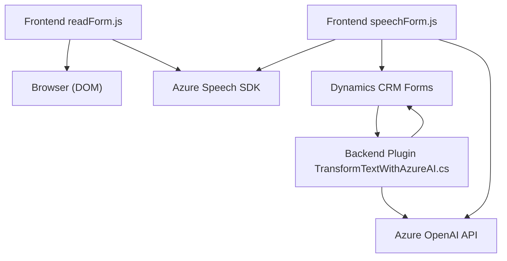

### Breve resumen técnico
El repositorio en cuestión parece ser una solución destinada a **automatizar la interacción con formularios dinámicos en Dynamics CRM** mediante la integración de tecnologías de reconocimiento y síntesis de voz, así como plugins personalizados que aprovechan las capacidades de **Azure OpenAI**. La solución está diseñada para mejorar procesos de accesibilidad y para facilitar la entrada y procesamiento de datos a través de comandos hablados y fórmulas dinámicas.

---

### Descripción de arquitectura
#### Organización general
La solución tiene una arquitectura **mixta**:
1. **Frontend:** Se organiza como código JavaScript modular en archivos separados, mostrando una estructura de lectura hacia un cliente (usando el DOM) y llamadas para interactuar con servicios externos (Azure Speech SDK y Dynamics CRM Web API).
2. **Backend (Plugins):** Un plugin C# alojado en Dynamics CRM (bajo la arquitectura del sistema CRM) que interactúa directamente con el servicio **Azure OpenAI**, aprovechando un diseño basado en **plugins** y **microservicios externos**.

#### Tipología de arquitectura
- **Frontend modular:** Orientado a la interacción de cliente y servicios SDK, y basado en paradigmas como callbacks y modularización de funciones (cada archivo tiene responsabilidades específicas).
- **Microfrontend:** Cada archivo tiene una función única (captura y procesamiento de voz, integración con SDK).
- **Microservicio en backend:** Utiliza servicios externos como Azure Speech SDK y el modelo Azure OpenAI, con comunicación RESTful para realizar tareas específicas.

El sistema como un todo sigue el patrón de diseño **n-capas**, con separación entre presentación (interacción con el usuario), lógica de negocio (procesamiento del habla en lenguaje natural) y acceso a datos HTPP/REST, conectando servicios externos (Azure Speech, Dynamics CRM Web API y Azure OpenAI).

---

### Tecnologías usadas
#### Tecnologías y herramientas identificadas:
1. **Frontend (JavaScript):**
   - **Tecnologías y SDKs:** 
     - **Azure Speech SDK:** Para síntesis y reconocimiento de voz.
     - **DOM API:** Para manipulación de formularios en el navegador.
   - **Patrones:**
     - Modular programming (separación de funciones por tareas específicas).
     - Asynchronous programming (callbacks y promesas).
     - Gateway pattern (interacción con Dynamics CRM Web API).

2. **Backend (C# Plugin):**
   - **Tecnologías:**
     - **Azure OpenAI (GPT):** Servicio usado para transformar texto.
     - **Dynamics CRM Plugin architecture** (Microsoft.Xrm.Sdk): Programa del lado del servidor que escucha eventos específicos del CRM.
     - **System.Net.Http** (solicitudes REST/HTTP).
     - **Newtonsoft.Json y System.Text.Json** (procesamiento de JSON).
   - **Patrones:**
     - Plugin-based architecture para Dynamics CRM.
     - External Service Integration para interactuar con Azure OpenAI.
     - Microservicio para tareas específicas con servicios externos.

---

### Diagrama Mermaid compatible con **GitHub Markdown**
El diagrama describe los principales componentes del sistema y su interacción.

---

### Conclusión final
La solución representa una **plataforma avanzada y escalable** para la interacción mediante comandos de voz con formularios dinámicos en **Dynamics CRM**. La arquitectura combina una interfaz de usuario dinámica (frontend) con reconocimiento y síntesis de voz mediante el SDK de **Azure Speech**, junto con un plugin que utiliza **Azure OpenAI** para realizar transformaciones textuales de mayor fluidez.

#### Fortalezas:
- Uso extensivo de SDKs externos para añadir capacidades avanzadas como síntesis y reconocimiento de voz, transformaciones con IA.
- Modularidad y separación de responsabilidades claras tanto en el frontend como en el backend.
- Adecuada para entornos empresariales que buscan integración con Dynamics CRM y experiencia de usuario mejorada.

#### Áreas de mejora:
- La solución depende altamente de servicios externos (Azure Speech SDK, Azure OpenAI), lo que puede generar riesgos si la disponibilidad de estos servicios se ve comprometida.
- La definición de las funciones en los archivos frontend podría beneficiarse de una mayor validación de entrada.

En general, esta solución ofrece una implementación sólida en un entorno CRM con herramientas avanzadas de inteligencia artificial y síntesis/reconocimiento de voz.