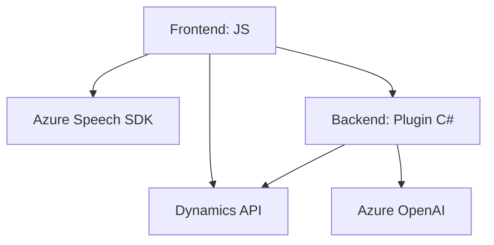

### Breve resumen técnico:
Este repositorio cuenta con múltiples archivos que implementan funcionalidades orientadas al reconocimiento de voz, la interacción con formularios, y la integración con servicios externos. Trabaja principalmente con bibliotecas SDK de Azure (Speech y OpenAI) y APIs de Dynamics CRM. Los archivos presentados abarcan tanto una solución para frontend (JavaScript) como un plugin para Microsoft Dynamics 365 con backend en C#.

---

### Descripción de la arquitectura:
1. La solución está dividida en dos capas principales:
   - **Frontend**: Archivo JavaScript para manejar interacción del usuario, integración con Azure Speech SDK y generación de texto.
   - **Backend Plugin**: Código C# que transforma el texto mediante Azure OpenAI API cuando se llama al plugin desde Dynamics CRM.

2. **Patrones identificados**:
   - **Cliente-Servidor**: El frontend interactúa con Azure Speech para la síntesis y transcripción de voz, mientras que el backend maneja la lógica de transformación avanzada del texto con Azure OpenAI.
   - **Modular Architecture**: Los archivos están diseñados con módulos funcionales que separan las responsabilidades.
   - **Event-driven Programming**: Tanto en frontend como en backend, el flujo de eventos se gestiona mediante callbacks (por ejemplo, espera a la carga del SDK de Azure en el frontend; espera a la ejecución de un evento en el plugin de CRM).
   - **Servicios externos y plugins**: Se integra con Azure Speech y Azure OpenAI mediante API REST, y con Dynamics CRM mediante plugins.

3. **Tipo de arquitectura general**: 
   - **Distribuida con integración cliente-servidor**: Combina frontend manejado en JavaScript y plugins backend en C#. Las integraciones con servicios externos como Azure refuerzan esta orientación.
   - Aunque existen varias capas funcionales (transcripción, mapeo y transformación), no se observa un diseño de arquitectura claramente hexagonal, pero sí modular.

---

### Tecnologías usadas:
1. **Frontend:**
   - **Azure Speech SDK**: Para reconocimiento y síntesis de voz.
   - **JavaScript**: Lógica dinámica de frontend.
   - **APIs de Dynamics CRM**: Manejo de entidades y datos del formulario.

2. **Backend:**
   - **Azure OpenAI**: Para servicios inteligentes de procesamiento de texto.
   - **Microsoft Dynamics SDK**: Desarrollo de plugins en capas de negocio de Dynamics CRM.
   - **C#** con dependencias como `System.Net.Http`, `System.Text.Json`, y `Newtonsoft.Json`.

---

### Diagrama Mermaid

---

### Conclusión final:
La solución presentada combina una capa de frontend para interacción de usuario y manejo de voz con un backend basado en plugins para Microsoft Dynamics 365. Se integra eficientemente con servicios de Microsoft Azure (Speech y OpenAI) para aprovechar capacidades de IA como transcripción de voz y procesamiento avanzado de texto. Aunque la arquitectura general no sigue un patrón específico (como hexagonal o microservicios), presenta características de arquitectura modular y cliente-servidor distribuida que promueven la reutilización y la separación de responsabilidades.

Es funcional y bien estructurado para el caso de uso planteado, pero podría beneficiarse de mejoras en seguridad (manejo de claves a través de configuración segura) y de mejores técnicas de refactorización para optimizar código redundante.