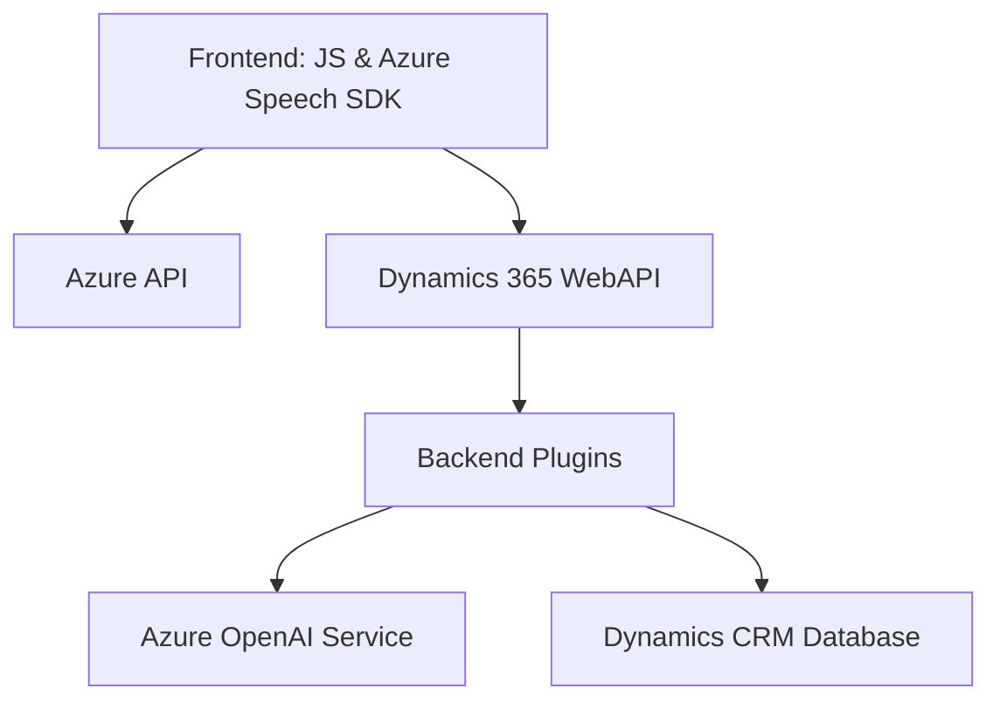

### Breve resumen técnico:
El repositorio parece centrarse en ofrecer una solución orientada a mejorar la interacción con formularios en Dynamics 365 mediante el uso de tecnologías avanzadas como el Azure Speech SDK y Azure OpenAI. Los archivos analizados muestran un enfoque modular, aprovechando APIs externas y funciones dedicadas al procesamiento de datos y la interacción con IA.

---

### Descripción de arquitectura:
La solución tiene una arquitectura híbrida con elementos de **n capas** en el frontend y el backend. En el frontend, las funciones están organizadas de forma modular y siguen el principio de separación de responsabilidades. Por su parte, en el backend se observan patrones orientados a servicios, como el **API Gateway**, que facilita la integración con Azure OpenAI y Dynamics 365.

El uso de plugins en **Dynamics CRM** muestra una arquitectura extensible y adaptable. La inclusión de varias capas de procesamiento entre frontend, APIs externas y el sistema CRM fomenta una estructura escalable y desacoplada.

---

### Tecnologías usadas:
1. **Frontend:**
   - **JavaScript ES6:** Es el lenguaje utilizado en los archivos `readForm.js` y `speechForm.js`.
   - **Azure Speech SDK**: Implementa funcionalidades de síntesis y reconocimiento de voz.
   - **Microsoft Dynamics 365 WebAPI (Xrm.WebApi)**: Utilizado para la interacción con los atributos y entidades del CRM.
   - **REST APIs**: Llamadas a APIs personalizadas para servicios de IA y registro de datos.
   
2. **Backend:**
   - **C# (.NET Framework)**: Utilizado en los plugins de Dynamics CRM.
   - **Newtonsoft.Json**: Manipulación JSON en el backend.
   - **System.Net.Http**: Para realizar llamadas HTTP a servicios externos.
   - **Azure OpenAI Service**: Procesamiento basado en IA para transformación de texto.

---

### Diagrama **Mermaid** válido para GitHub:

---

### Conclusión final:
Esta solución es una implementación híbrida de herramientas y tecnologías Microsoft que combina elementos de frontend, backend y procesamiento basado en IA. La arquitectura modular asegura una buena separación de responsabilidades y escalabilidad. Además, la integración con servicios externos como Azure Speech SDK y OpenAI añade un alto nivel de funcionalidad avanzada al sistema.

Se observa que los principios de modularidad, servicios desacoplados y extensibilidad en entornos de Microsoft Dynamics están bien empleados en esta solución. Sin embargo, podría mejorarse documentando explícitamente cualquier vulnerabilidad potencial en las llamadas a APIs externas, así como optimizando el manejo de errores para garantizar mayor robustez.