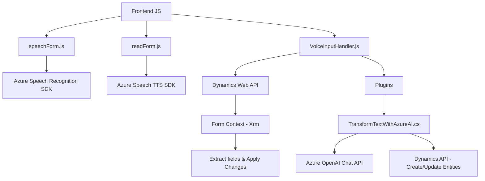

### Breve resumen técnico
El repositorio es altamente especializado para gestionar formularios y el procesamiento de datos mediante interacción con APIs de Azure y Dynamics 365. Está dividido en tres módulos principales:
1. **Frontend**: Implementa la interacción de formularios con las funcionalidades de síntesis y transcripción de voz usando el Azure Speech SDK.
2. **Plugins**: Amplía las capacidades de Dynamics 365, utilizando la API de Azure OpenAI para transformar texto en JSON estructurado.
3. **Voice Input Handler**: Facilita la entrada por voz en formularios y permite la actualización de campos de manera dinámica.

### Descripción de arquitectura
La arquitectura es híbrida:
- **Frontend**: Modular y basado en componentes de JS que interactúan directamente con APIs externas para síntesis y análisis de voz.
- **Backend**: Extensible mediante plugins para Dynamics 365, con una separación clara de responsabilidades. Cada componente se centra en una tarea específica.
- **Patrones utilizados**:
  - **Microservicio**: Comunicación con servicios de Azure (OpenAI y Speech SDK) para delegar funcionalidades.
  - **Integración Modular**: Usa módulos JavaScript como bloques para facilitar el consumo en clientes web.
  - **Pipeline de procesamiento**: Flujo secuencial de extracción, análisis y procesamiento de datos visible en el formulario.

### Tecnologías usadas
1. **Frontend**:
   - **Azure Speech SDK**: Para síntesis de voz y reconocimiento de comandos mediante entrada por voz.
   - **JavaScript**: Para implementar lógica del lado del cliente interactuando con formularios.
   - **Dynamics Web API**: Interacción mediante los métodos `Xrm`.

2. **Backend Plugins**:
   - **Azure OpenAI API**: Procesamiento de datos textuales mediante IA.
   - **Microsoft Dynamics 365 SDK**: Extensión funcional mediante plugins que interactúan con servicios internos del CRM.
   - Framework .NET (C#): Para implementar el plugin de Dynamics.

3. **Dependencias externas**:
   - `Newtonsoft.Json`, `System.Net.Http`, `System.Text.Json`: Para manipulación de datos JSON y realizar llamadas HTTP.

### Diagrama Mermaid

### Conclusión final
El repositorio refleja una solución integrada para mejorar la experiencia de usuario en formularios de Dynamics 365, implementando funcionalidades avanzadas como síntesis de voz, transcripción y procesamiento de IA. La arquitectura se divide estratégicamente entre frontend y plugins backend. Mientras los scripts JS manejan la comunicación del cliente y las APIs externas, los plugins en C# actuando como extensiones en Dynamics 365 brindan capacidades avanzadas y procesamiento personalizado por medio de la API de OpenAI. Esto se alinea bien con los principios de modularidad y desacoplamiento.