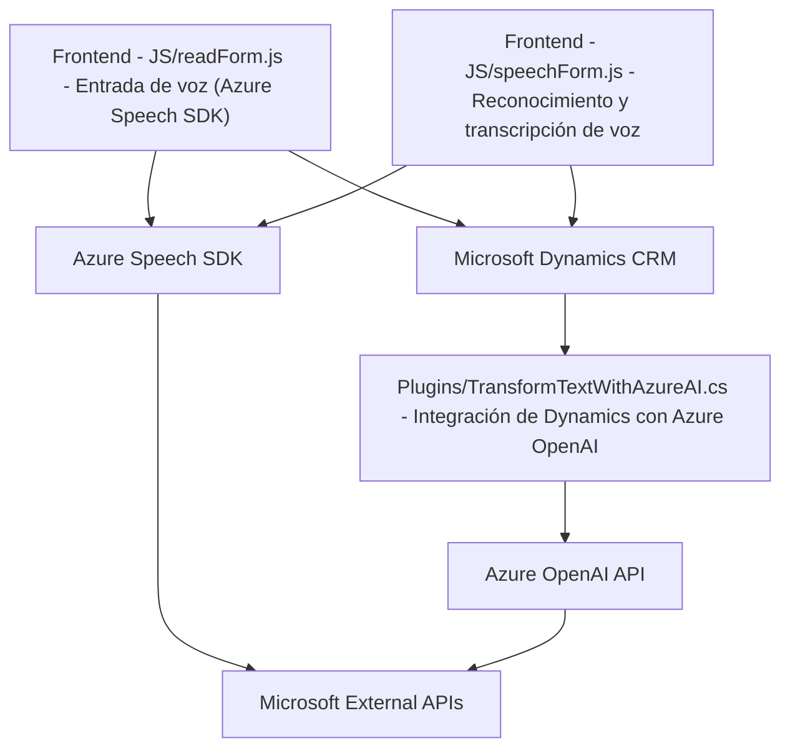

### Análisis Técnico

#### Breve Resumen Técnico:
Los archivos del repositorio describen una solución que combina funcionalidades de integración entre un sistema de formulario en Dynamics 365, entrada/salida de voz mediante el Azure Speech SDK, y un plugin que utiliza un modelo de procesamiento de lenguaje natural basado en Azure OpenAI. La solución fomenta la automatización y mejora de la experiencia del usuario al interactuar con datos del formulario y gestionar tareas de reconocimiento y síntesis de voz.

### Descripción de la Arquitectura:
La solución utiliza una arquitectura distribuida con alto nivel de modularidad. Combina lógica en frontend y un plugin backend para extender las capacidades del sistema CRM. Utiliza el patrón **n capas** para separar la lógica de presentación (Frontend que interactúa con Azure Speech SDK y Microsoft Dynamics), la lógica de negocio (procesamiento por el plugin y llamadas APIs) y la integración con servicios externos (Azure Speech SDK y OpenAI API). La arquitectura se aproxima también a conceptos de **arquitectura hexagonal**, sobre todo en la capa backend, al integrar APIs externas.

Se observa el uso de múltiples patrones de diseño:
1. **Modularización**: Cada funcionalidad se encapsula en su respectivo archivo con funciones específicas.
2. **Asynchronous Programming**: Uso de promesas y callbacks en la gestión de Azure Speech SDK y Dynamics APIs.
3. **Dependency Injection**: Uso del objeto `IServiceProvider` en el plugin para cumplir con el patrón de inyección de dependencia.
4. **Service Integration**: Comunicación con APIs externas (Azure Speech SDK y Azure OpenAI API).

### Tecnologías Usadas:
1. **Azure Speech SDK**
   - Funciones de síntesis de voz (text-to-speech) y reconocimiento de voz (speech-to-text).
   - Capacidad de desenfocar la interacción entre usuarios y sistemas de Dynamics, haciendo uso del habla como principal medio de comunicación.

2. **Microsoft Dynamics 365 SDK**
   - Acceso y manipulación de formularios y datos del lado del cliente.
   - Integración de plugins para la ejecución de lógica de negocio dentro del ecosistema CRM.

3. **Azure OpenAI Service**
   - Procesamiento del lenguaje natural basado en GPT para transformar input textual en outputs estructurados.

4. **JavaScript ES6**
   - Uso de un estilo moderno en los archivos del frontend para modularidad y asincronía.

5. **C# y .NET Framework**
   - Para implementar el plugin que ejecuta lógica basada en el contexto del CRM, haciendo uso de las clases y servicios proporcionados por Microsoft.Xrm.Sdk.

6. **HTTP API Integration**
   - Se emplea tanto para la relación con el Azure Speech SDK como para consumir la API de Azure OpenAI para realizar tareas específicas.

### Dependencias o Componentes Externos:
1. **Azure Speech Services**: Para reconocimiento y síntesis de voz.
2. **Azure OpenAI Services**: Para transformaciones avanzadas de texto.
3. **Microsoft Dynamics CRM and SDK**: Para el framework y operaciones relacionadas con el formulario.
4. **REST APIs**: Microsoft REST APIs para el acceso a datos y ejecutar Custom APIs.
5. **C# Libraries**:
   - Newtonsoft.Json
   - System.Net.Http
   - System.Text.Json
6. **JavaScript Libraries**:
   - Posible uso de utilities en frontend (dependencias como jQuery no mencionadas pero posibles).

### Diagrama Mermaid:

### Conclusión Final:
Este repositorio describe una solución que integra dos herramientas principales de Azure (Speech SDK y OpenAI Service) en el contexto de formularios en Microsoft Dynamics 365 CRM. La arquitectura combina elementos de **n capas** con integración de servicios externos en una implementación modular y mantenible. La solución está diseñada para enriquecer la interacción mediante la voz y aprovechar capacidades avanzadas de Inteligencia Artificial para procesar datos estructurados. Es ideal para sistemas que buscan mejorar la experiencia del usuario y automatizar tareas relacionadas con datos.