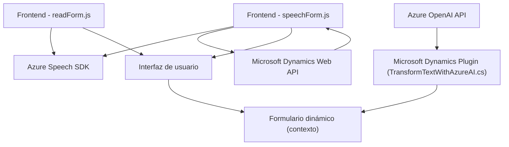

# Resumen técnico

El repositorio parece centrarse en **procesamiento de voz** y **transformación de texto**, basado en los servicios de Azure. Contiene tres áreas principales:

1. **Frontend/JS/readForm.js**: Captura información de un formulario visible en la interfaz y la reproduce como voz usando el SDK de Azure Speech.
2. **Frontend/JS/speechForm.js**: Implementa transcripción de voz y procesamiento de datos transcritos en formularios interactivos, integrando Azure Speech SDK para reconocimiento de voz.
3. **Plugins/TransformTextWithAzureAI.cs**: Implementa un plugin para Microsoft Dynamics CRM; transforma texto con Azure OpenAI, generando un JSON estructurado.

---

## Descripción de arquitectura

La solución sigue una arquitectura **modular basada en capas funcionales**, típica de aplicaciones híbridas y multicomponente. Se aprecia un enfoque estructurado con separación clara entre:
- **Frontend**: Realiza captura de datos por voz o interfaz gráfica y procesa la información en tiempo real.
- **Backend (Plugin)**: Provee generación de datos estructurados con el uso de Azure OpenAI, implementando funciones específicas de Microsoft Dynamics CRM.

Aunque sus elementos se relacionan y dependen entre sí por datos y APIs comunes, no se trata aún de un sistema completo basado en microservicios. El diseño refuerza una arquitectura **n capas**, donde cada capa tiene responsabilidades específicas:
1. **Capa de presentación (Frontend)**: Captura datos y los gestiona según la interacción del usuario.
2. **Capa de lógica de negocio (Plugin)**: Aplica inteligencia artificial y transforma datos por medio de Azure OpenAI, mejorando decisiones del CRM.
3. **Capa de integración/API**: Conectividad con servicios externos como Azure Speech SDK, Microsoft Web API y Azure OpenAI.

---

## Tecnologías usadas

### **Frontend**
1. **Azure Speech SDK**: Captura y generación de voz.
2. **JavaScript**: Funciones modulares para aspectos de procesamiento y síntesis de voz.
3. **Callbacks y promesas**: Manejo asíncrono de SDK externos y API web.
4. **Interacción dinámica**: Procesamiento de formularios dinámicos en plataformas como Microsoft Dynamics.

### **Backend (Plugin)**
1. **Microsoft Dynamics SDK**: Integración CRM.
2. **Azure OpenAI**: Uso de inteligencia artificial para transformar texto en JSON estructurado.
3. **C#**: Desarrollo del plugin de CRM con estándares del framework .NET.
4. **Newtonsoft.Json.Linq**: Manipulación de datos obtenidos en formato JSON.

### **Servicios externos**
- **Azure Speech SDK**: Reconocimiento de voz, síntesis de texto a voz.
- **Azure OpenAI API**: Transformación de texto mediante reglas inteligentes.
- **Microsoft Dynamics Web API**.

---

## Diagrama Mermaid

El siguiente diagrama muestra los componentes principales del sistema, su interacción y relación con servicios externos.

---

## Conclusión final

Este repositorio presenta una solución moderna que integra el manejo de datos y procesamiento por voz en formularios interactivos, complementado por inteligencia artificial de Azure OpenAI. Su arquitectura consiste en **n capas bien definidas**, con separación clara entre frontend y backend, y soportada por servicios de Microsoft y Azure en ambos extremos. 

Recomendación:
- Podría evolucionarse hacia un sistema basado en microservicios para escalar más fácilmente.
- Configuración como claves y endpoints deberían moverse hacia un sistema de gestión seguro, como Azure Key Vault.