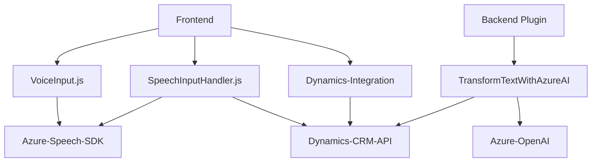

### Breve resumen técnico
El repositorio contiene tres componentes principales:
1. **Frontend (JavaScript):** Implementa funcionalidades de Input/Output de voz y procesamiento local o a través de APIs usando **Azure Speech SDK** y **Dynamics 365 API**.
2. **Backend Plugin (C#):** Integra y extiende Dynamics CRM mediante un plugin especializado que interactúa con **Azure OpenAI API** para transformar texto y opera en el entorno Dynamics.
3. **Modularidad basada en servicios externos:** Explotación del SDK de Azure Speech y servicios CRM/AI en aislamiento.

---

### Descripción de arquitectura
- **Frontend**:
  - Arquitectura basada en **event-driven programming** para la interfaz de voz, gestionando eventos como entrada de voz y lectura del formulario.
  - Modularidad a nivel de funciones para dividir claramente las responsabilidades: captura de voz, procesamiento, y actualización de formularios.

- **Backend Plugin**:
  - **Single Responsibility Principle (SRP):** La clase en el plugin tiene un enfoque dedicado al procesamiento y transformación de texto externo.  
  - **Service-Oriented Architecture (SOA):** Delegación del procesamiento en servicios externos como **Azure OpenAI API**.

- **General**:
  - Una solución híbrida con componentes independientes interconectados (frontend interactivo y backend computacional extensible).
  - Arquitectura **n capas**: Los flujos que intervienen están altamente desacoplados entre interfaz de usuario, lógica, y servicios externos.

---

### Tecnologías usadas
1. **Frontend**:
   - **JavaScript**: Lenguaje base para las funcionalidades de entrada/salida de voz y relación con APIs.
   - **Azure Speech SDK**: Para reconocimiento de voz y síntesis de habla.
   - **Dynamics 365 API (`Xrm.WebApi`)**: Para comunicación con formularios y actualizaciones de datos en el CRM.
   
2. **Backend Plugin**:
   - **Microsoft Dynamics SDK**: Para desarrollar el plugin y gestionar la lógica del CRM.
   - **Azure OpenAI Service**: Para procesamiento avanzado de texto con modelos como GPT.
   - **ASP.NET / C#**: Tecnología base para el desarrollo del plugin y manipulación del contexto del CRM.
   - **JSON Librerías (Newtonsoft.Json)**: Para manejar operaciones JSON.

3. **Otros Patrones y Tecnologías**:
   - Patrón **event-driven** para manejar interacciones de usuario.
   - Comunicación mediante **HTTP REST API**.
   - Uso del **Single Responsibility Principle** y lógica desacoplada.

---

### Diagrama Mermaid (GitHub compatible)

---

### Conclusión final
Esta solución es una integración completa entre **frontend (JavaScript)**, **external services (API)**, y **backend plugin (C#)**. Se implementa una arquitectura **n capas** con marcado desacoplamiento entre lógica de presentación, lógica de negocio, y toma de decisiones basada en sistemas externos. Además, utiliza tecnologías modernas, como **Azure Speech SDK** y **Azure OpenAI**, junto con el ecosistema de **Dynamics CRM**.

Sin embargo, hay áreas de mejora:
- **Gestión de credenciales**: Las claves API deberían estar mejor protegidas usando variables de entorno o servicios seguros.
- **Optimización**: Podría beneficiarse de una traza más completa y gestión de errores para garantizar la confiabilidad y diagnósticos adecuados frente a fallos.