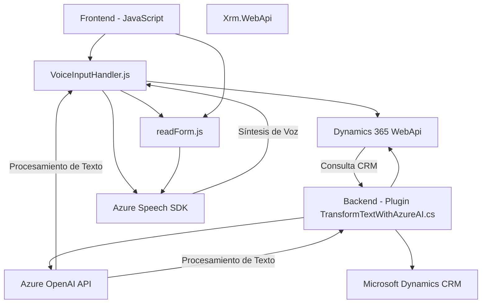

### Breve resumen técnico:

El repositorio parece estar diseñado para una solución de **ASP.NET y Dynamics CRM**, donde se integran funcionalidades para el procesamiento de formularios, interacción con usuarios mediante reconocimiento de voz y síntesis de texto a voz utilizando **Azure Speech SDK** y **Azure OpenAI API**. Junto con el código del frontend escrito en JavaScript, se observe funcionalidad que opera sobre formularios interactivos. A nivel del backend, se incluyen plugins en .NET C# orientados a extender las capacidades del modelo CRM, interactuando con inteligencia artificial para transformar datos.

---

### Descripción de arquitectura:

La arquitectura general parece ser una mezcla de **arquitectura de n capas** (donde el frontend y el backend están separados) con elementos de llamada a servicios externos. Los archivos del frontend actúan como una capa de presentación, interactuando directamente con formularios y servicios de voz. Por otro lado, el plugin de backend implementa una capa de negocio y se integra en el ecosistema de **Microsoft Dynamics CRM** para realizar transformaciones de datos, además de consumir servicios externos como **Azure OpenAI API**.

Puntos clave:
1. **Capa de presentación (Frontend):** Implementada en JavaScript con funcionalidades para reconocimiento y síntesis de voz, interactúa con Azure Speech SDK y Dynamics 365 API directamente desde el navegador.
2. **Capa de negocio (Backend):** Plugin `TransformTextWithAzureAI` para Dynamics CRM que extiende las capacidades del modelo mediante lógica personalizada con acceso a Azure OpenAI.
3. **Dependencia de servicios externos:** La solución consume servicios externos como **Azure Speech SDK** y **Azure OpenAI API** para poder implementar capacidades avanzadas de IA y voz.

---

### Tecnologías usadas:
1. **JavaScript:**
   - Uso en frontend para manipulación de formularios HTML y consumo de servicios externos.
   - Integración directa con SDK de Azure para reconocimiento/síntesis de voz.
2. **Microsoft Dynamics CRM:**
   - Plugins extensibles basados en .NET para modificar funcionalidad empresarial.
3. **ASP.NET (C#):**
   - Plugins implementados para integración con Dynamics CRM y Azure OpenAI.
4. **Azure Speech SDK:** 
   - Reconocimiento y síntesis de voz en tiempo real desde el navegador.
5. **Azure OpenAI API:**
   - Transformación de texto mediante modelos de procesamiento de lenguaje (GPT en particular).
6. **APIs REST (Dynamics WebApi y Azure API):**
   - Llamadas HTTP para integración del frontend y los plugins con servicios externos.
7. **Newtonsoft.Json & JSON.NET:**
   - Procesamiento y manipulación de objetos JSON en C#.

---

### Diagrama **Mermaid** válido:

---

### Conclusión final:

La solución está diseñada para proporcionar un flujo de trabajo integrado entre el frontend, el backend, y múltiples servicios en la nube (Azure). Las capacidades avanzadas de IA, junto con el soporte de síntesis/reconocimiento de voz, hacen que esta solución sea particularmente útil para aplicaciones de accesibilidad, digitalización de datos, y automatización de procesos empresariales. Aunque la arquitectura se parece a un **modelo n capas**, la fuerte integración con servicios Cloud y CRM también refleja principios de **arquitectura orientada a servicios**. 

Si se optimizan estos servicios correctamente y se asegura la modularidad, este proyecto tiene el potencial de ser escalable y adaptable a diferentes dominios empresariales.