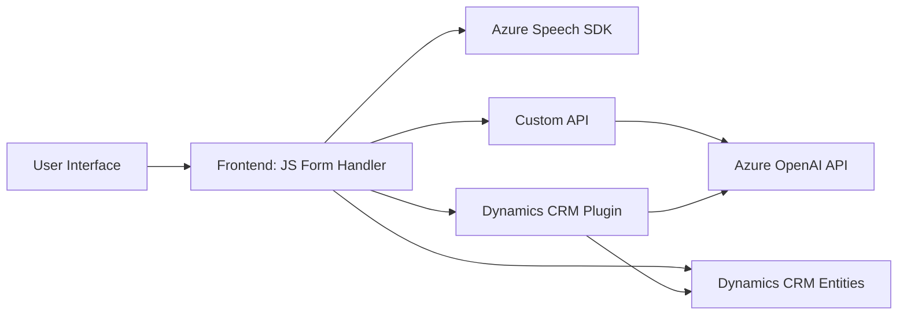

### Breve resumen técnico
Este repositorio es parte de una solución que integra servicios externos como **Azure Speech SDK** y **Azure OpenAI API** dentro de un sistema de gestión de formularios visuales, probablemente en el entorno CRM de Microsoft Dynamics. Utiliza voz como entrada y salida para interactuar con formularios y aplicar reglas de datos dinámicas.

---

### Descripción de arquitectura
La arquitectura del sistema sigue el **patrón de capas** con separación entre:
1. **Frontend**: Los archivos JavaScript (como `readForm.js` y `speechForm.js`) están diseñados para interactuar con el usuario en el navegador, procesar datos del DOM y enviar o recibir datos de APIs externas.
2. **Servicios externos**: Utiliza Azure Speech SDK y OpenAI GPT a través de un plugin en Dynamics CRM para funciones específicas como reconocimiento de voz, síntesis de voz, y transformación dinámica del texto hablado o ingresado.
3. **Backend**: Se basa en la arquitectura de plugins de Dynamics CRM, empleando la integración con .NET y el SDK de Microsoft para interacciones con APIs, procesamiento de datos, y reglas de negocio.

En general, la solución tiene componentes distribuidos que apuntan hacia un acercamiento **monolítico multicapa** en el backend (Dynamics CRM) que se comunica con APIs externas para lógica específica (chatbots, IA), mientras el front es principalmente responsable de la experiencia de usuario.

---

### Tecnologías usadas
1. **Microsoft Dynamics CRM SDK**:
   - Framework para desarrollo de plugins en plataformas Dynamics.
   - Código backend (C#) usa interfaces como `IPlugin`, `Microsoft.Xrm.Sdk`.
   
2. **Azure Speech SDK**:
   - Utilizado en el frontend para captación de voz, síntesis de texto a voz, y generación de transcripciones.

3. **Azure OpenAI API (GPT)**:
   - Transformación IA del texto relacionado con las operaciones del plugin de CRM.

4. **Bases de datos (Dynamics CRM)**:
   - Relación entre formulario, atributos, y entidades en el CRM.

5. **Otros**:
   - `Newtonsoft.Json` para serialización/deserialización de datos JSON.
   - HTTP Client en C# para consumir APIs externas.
   - HTML DOM y frontend JavaScript para interacción con formularios.

---

### Diagrama Mermaid válido para GitHub

---

### Conclusión final
El repositorio combina tecnologías modernas como **Azure Speech SDK** y **OpenAI API** con **Dynamics CRM plugins** en un entorno organizado por capas. Aunque los archivos están separados por un enfoque modular, el diseño centralizado basado en la plataforma Dynamics indica una arquitectura **monolítica multicapa**. La solución ofrece una experiencia robusta centrada en interacciones de voz para gestionar formularios, apoyándose en AI para transformaciones de texto y mapeos dinámicos. Es ideal para empresas que desean integrar tecnologías de reconocimiento de voz y generación de texto con su sistema CRM.