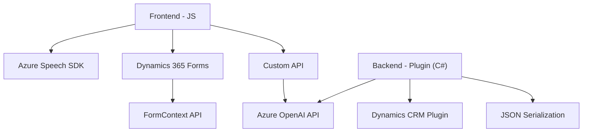

### Breve resumen técnico
El repositorio parece estar relacionado con una solución de automatización de formularios en Dynamics 365 y procesamiento de voz mediante servicios externos (principalmente Azure Speech SDK y Azure OpenAI). Incluye archivos para un frontend en JavaScript (integración con Dynamics 365 y Azure Speech SDK) y un plugin backend en .NET que interactúa con OpenAI para transformar textos. 

---

### Descripción de arquitectura
La solución tiene una arquitectura **modular funcional**, dividida en dos capas principales:
1. **Frontend (JS):** Implementa funciones para entrada de voz, procesamiento de formularios, comunicación con APIs externas (Azure Speech SDK y Custom API), y interactúa directamente con Dynamics 365.
2. **Backend (C# Plugin):** Define un plugin que interviene en la lógica del CRM para transformar texto mediante Azure OpenAI.

A nivel global se puede categorizar como una **arquitectura de 2 capas (frontend y backend)** usando una integración con servicios externos (Azure Speech SDK, Azure OpenAI API). El patrón de diseño predominante es **event-driven** para la ejecución de funcionalidades basadas en inputs (voz, eventos de Dynamics) y **modularización funcional**.

---

### Tecnologías utilizadas
1. **Frontend (JavaScript):**
   - Azure Speech SDK: Reconocimiento de entrada de voz y síntesis de texto a audio.
   - Dynamics 365 Form Context API: Interacciones directas con formularios.
   - JavaScript ES6+: Lenguaje base para manipulación del DOM y lógica de formularios.
   - REST API: Para ejecutar operaciones en el backend (es probable que se usen XHR/Fetch APIs para llamadas).

2. **Backend (C# Plugin):**
   - .NET Framework.
   - Microsoft Dynamics CRM SDK: Extensiones para plugins.
   - Azure OpenAI Service: Envío de prompts y transformación de texto en estructura JSON.
   - System.Text.Json y Newtonsoft.Json: Para el procesamiento de datos JSON.
   - System.Net.Http: Comunicación con Azure APIs.

3. **Integraciones externas:**
   - Azure Speech SDK (CDN).
   - Azure OpenAI Service (Cloud-based AI).

---

### Diagrama Mermaid válido para GitHub

---

### Conclusión final
La solución implementada en este repositorio parece enfocarse en integrar tecnologías para flujo automatizado de voz, texto y datos, con interacciones en plataformas de Dynamics 365. En el **Frontend**, se utiliza **Azure Speech SDK** y un diseño modular de funciones para permitir entrada y salida por voz y manipulación de formularios. En el **Backend**, se usa un plugin basado en **Microsoft Dynamics CRM SDK** y Azure OpenAI Service para procesamiento inteligente de texto.

La arquitectura es **modular y funcional**, con una división clara en dos capas (Frontend y Backend) y múltiples servicios externos para las funcionalidades avanzadas. Es una solución robusta para lograr integración entre entrada de voz, APIs cloud, y sistemas CRM.