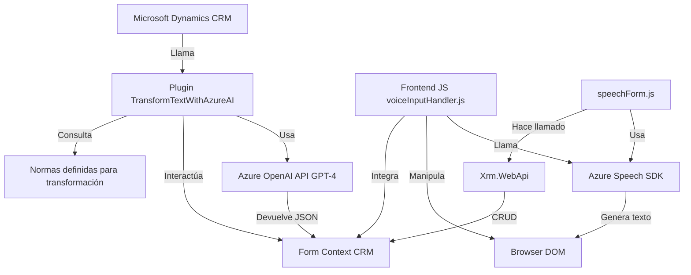

### Resumen técnico
Este proyecto integra tecnologías frontend y backend bajo una solución que mejora la accesibilidad e inteligencia de los datos en formularios dinámicos interactivos. Usa herramientas como Azure Speech SDK y Azure OpenAI para proporcionar sistemas avanzados de reconocimiento de voz y procesamiento de texto.

La solución implementa funciones accesibles tanto en el frontend como en plugins para servicios CRM (Microsoft Dynamics). Está diseñada para aumentar la interacción humano-sistema mediante comandos de voz y generar estructuras JSON utilizando IA.

---

### Descripción de arquitectura
La solución tiene una arquitectura de **n-capas**, donde cada capa funcional colabora para implementar características específicas:

- **Frontend (Javascript):** Implementa funcionalidades como la lectura de campos visibles en formularios, interacción con reconocimiento de voz y vocalización. Usa Azure Speech SDK para procesamiento de voz.
- **Backend (Plugins en C#):** Extiende la funcionalidad del CRM utilizando APIs de Azure OpenAI integradas con Dynamics CRM. Ofrece procesamiento avanzado para transformar texto en datos estructurados.
- **Integración con servicios externos:** Gran parte de la funcionalidad se basa en el uso de Azure Speech SDK y Azure OpenAI para realizar tareas específicas (reconocimiento de voz y transformación a JSON).

Las responsabilidades están claramente divididas entre frontend y backend, logrando modularidad y reutilización. El proyecto utiliza patrones como delegado, facade, y Dynamic Dependency Loading para cargar scripts solo cuando sean necesarios.

---

### Tecnologías usadas
1. **Frontend:**
   - JavaScript: Base del desarrollo para manipulación de formularios y llamadas a APIs externas.
   - **Azure Speech SDK:** Para reconocimiento de voz y lectura de información en tiempo real.
   - **Azure AI:** Para integración con IA en procesamiento y generación de transcripciones.

2. **Backend:**
   - **C#:** Funcionalidad avanzada de procesamiento y comunicación con Dynamics CRM.
   - **Microsoft Dynamics CRM SDK:** Gestión de datos y eventos en el entorno CRM.
   - **Azure OpenAI API (GPT-4):** Procesamiento de texto e integración de IA.
   - **System.Text.Json:** Serialización y deserialización de objetos JSON.
   - **Newtonsoft.Json.Linq:** Manipulación legacy de objetos JSON.

3. **Patrones de diseño:**
   - **Facade Pattern:** Simplificación de interacciones complejas con APIs como Speech SDK.
   - **Dynamic Dependency Loading:** Carga de librerías únicamente cuando son necesarias.
   - **Event-Driven Programming:** Principalmente en el frontend, con activadores basados en eventos de UI.
   - **Service Dependency Injection:** Utilizado para comunicarse con APIs externas como Azure OpenAI.

---

### Diagrama Mermaid válido para **GitHub**

---

### Conclusión final
El proyecto implementa una arquitectura **n-capas** para gestionar formularios dinámicos interactivos enfocados en accesibilidad y procesamiento inteligente. Utiliza servicios de reconocimiento de voz y procesamiento de texto estructurado mediante IA, integrados tanto en el frontend como el backend (CRM).

Es una solución robusta que combina tecnologías modernas de Microsoft como Azure Speech SDK, OpenAI GPT-4 y Dynamics CRM. La arquitectura modular permite un desarrollo escalable y adaptable, lo que lo hace ideal para entornos corporativos donde la accesibilidad y la inteligencia artificial son críticas.