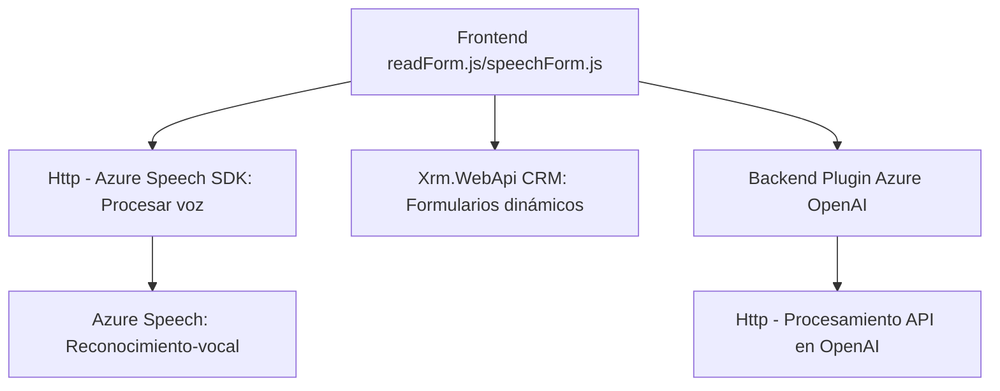

### Breve resumen técnico:
El repositorio muestra tres componentes principales:  
1. Un conjunto de **archivos frontend JavaScript** que interactúan con formularios mediante reconocimiento de voz y servicios de Azure Speech SDK.  
2. Un archivo backend en **C# para Dynamics CRM** que utiliza Azure OpenAI para transformar texto.  
3. **Integración** entre formularios interactivos y servicios cognitivos para proporcionar una experiencia asistida mediante voz e inteligencia artificial.  

---

### Descripción de la arquitectura:
La solución presenta una arquitectura **n-capas**:
- **Capa frontal (Frontend)**: Archivos JavaScript (`readForm.js`, `speechForm.js`) que procesan el reconocimiento de voz y manipulan los formularios, interactuando directamente con los usuarios.
- **Capa lógica (Plugin Dynamics)**: El plugin en C# que procesa texto mediante Azure OpenAI y lo devuelve al contexto CRM.
- **Capa de servicios externos**: Azure Speech SDK y Azure OpenAI para procesamiento cognitivo y reconocimiento de voz.  

**Patrones utilizados:**
- **Cargador dinámico:** Garantiza la disponibilidad del SDK de Azure Speech antes del uso.  
- **Separación de responsabilidades:** Cada función se enfocada en una tarea específica para mejorar la modularidad.  
- **Integración con servicios:** Usa APIs de Azure (Speech y OpenAI) para enriquecer funcionalidad interactiva y asistida.

---

### Tecnologías usadas:
1. **Frontend:**
   - **JavaScript ES6**: Para manipulación DOM e implementación de funciones asincrónicas.
   - **Azure Speech SDK**: Reconocimiento y síntesis de voz.  
   - **CRM Dynamics (Xrm.WebApi)**: Interacción con formularios dentro del CRM.
2. **Backend:**
   - **C# (.NET Framework)** con **Microsoft.Xrm.Sdk**: Para plugins de Dynamics CRM.  
   - **Azure OpenAI**: Procesamiento de texto en la capa lógica.  
   - **Bibliotecas estándar**: `HttpClient`, `Newtonsoft.Json`, etc., para llamadas a APIs y manipulación de datos.  

---

### Diagrama Mermaid:

---

### Conclusión final:
1. **Tipo de solución:** Es una solución híbrida diseñada como una extensión interactiva para formularios de Dynamics CRM, con soporte para reconocimiento de voz, síntesis de voz, y procesamiento inteligente de formularios a través de integración con Azure OpenAI.  
2. **Tecnologías:** Utiliza tecnologías modernas como Azure Cognitive Services (Speech SDK y OpenAI) para proporcionar una experiencia enriquecida.  
3. **Arquitectura:** Se organiza en capas (n-capas), destacando un diseño modular que permite la interacción entre frontend, servicios externos y lógica backend.  
4. **Beneficios:** Promueve integración cognitiva, mejora la interoperabilidad y ofrece modularidad para futuras ampliaciones.  

Esta solución puede ser reutilizada en otros contextos donde se requiera entrada asistida mediante voz e inteligencia artificial.