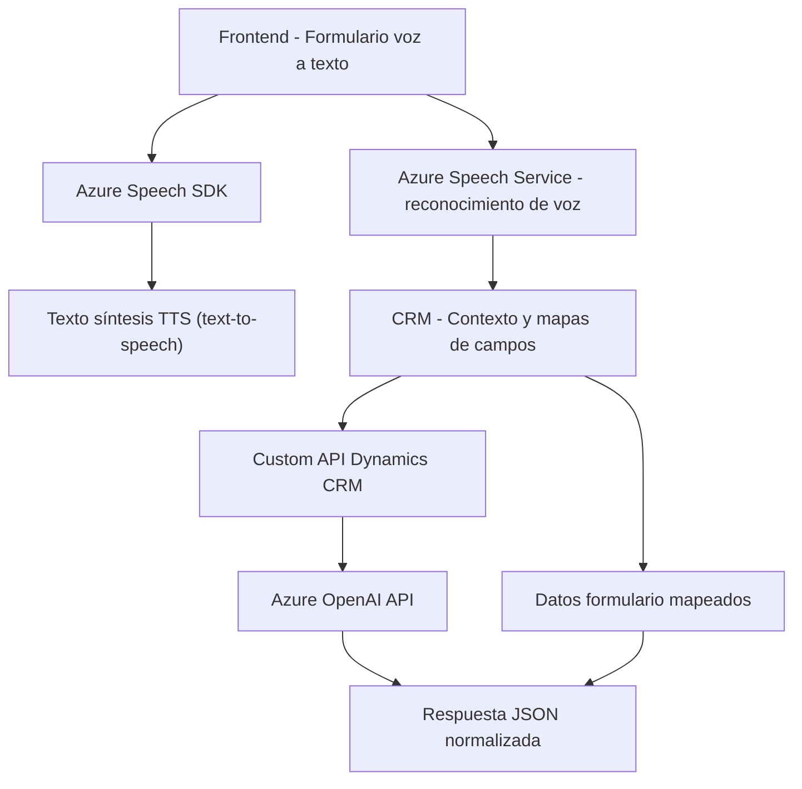

### Breve resumen técnico
El repositorio contiene tres módulos fundamentales que se integran en una solución de software de tipo **enterprise** para CRM Dynamics en combinación con servicios cloud de **Microsoft Azure** para voz, texto y procesamiento por inteligencia artificial. La solución incluye:
- **Frontend:** Para interacción con usuarios vía reconocimiento de habla y síntesis de voz (JavaScript).
- **Backend:** Para lógica adicional utilizando las capacidades de plugins en Dynamics CRM (C#).
- **Cloud Services:** Integración de servicios externos como **Azure Speech SDK** y **Azure OpenAI API**.

---

### Descripción de arquitectura
La solución sigue el patrón de **n capas** con desacoplamiento de responsabilidades:
1. **Capa de presentación (Frontend):** Utiliza JavaScript para captura de entrada del usuario (voz/forma hablada) y salida auditiva.
2. **Capa de negocio (Backend en Dynamics CRM):** Contiene plugins que ejecutan la lógica empresarial avanzada para transformar datos y coordinar interacciones con la API de Dynamics y Azure.
3. **Capa de servicios externos:** Apoya funciones complejas como síntesis y reconocimiento de voz (Azure Speech SDK) y transformación de texto utilizando un endpoint de Azure OpenAI.

Además, la arquitectura aprovecha principios de **modularización** y **servicios distribuidos**, consolidando la lógica empresarial en el backend y delegando las capacidades de inteligencia artificial al sistema cloud de Azure.

---

### Tecnologías usadas
1. **Frontend:**
   - Lenguaje: JavaScript ECMAScript 6+.
   - Frameworks/Librerías:
     - **Azure Speech SDK** para síntesis y reconocimiento de voz.
     
2. **Backend:**
   - Lenguaje: C# (.NET Framework).
   - APIs y SDKs:
     - **Microsoft.Xrm.SDK** para integración con Dynamics CRM.
     - **Newtonsoft.Json** y **System.Text.Json** para manipulación y manejo de JSON.
     - **System.Net.Http** para solicitudes HTTP a Azure.
     - **Azure OpenAI API** para procesamiento avanzado de texto con GPT.

---

### Dependencias y componentes externos
1. **Azure Speech SDK:** Proporciona capacidades de texto a voz y reconocimiento de habla en tiempo real.
2. **Azure OpenAI API:** Endpoint para procesar texto con GPT.
3. **Dynamics CRM Web API:** Facilita la interacción con los modelos y atributos de datos del sistema CRM.
4. **Frontend DOM:** Obtención de datos visibles y procesamiento directo con JavaScript (e.g., manejo de `createElement`, `appendChild`).

---

### Diagrama Mermaid
El siguiente diagrama describe las interacciones entre los componentes principales de la arquitectura.

---

### Conclusión final
Los archivos presentados configuran una solución técnica avanzada para la integración de capacidades de voz y procesamiento de texto en aplicaciones CRM mediante el uso de servicios en la nube y arquitecturas de **n capas**. Destaca por el uso eficiente de SDKs y servicios externos (Azure Speech y OpenAI API) que extienden las capacidades tecnológicas del sistema, ofreciendo una solución adaptable para mejorar la interacción entre usuarios y el CRM mediante inteligencia artificial y servicios de voz.