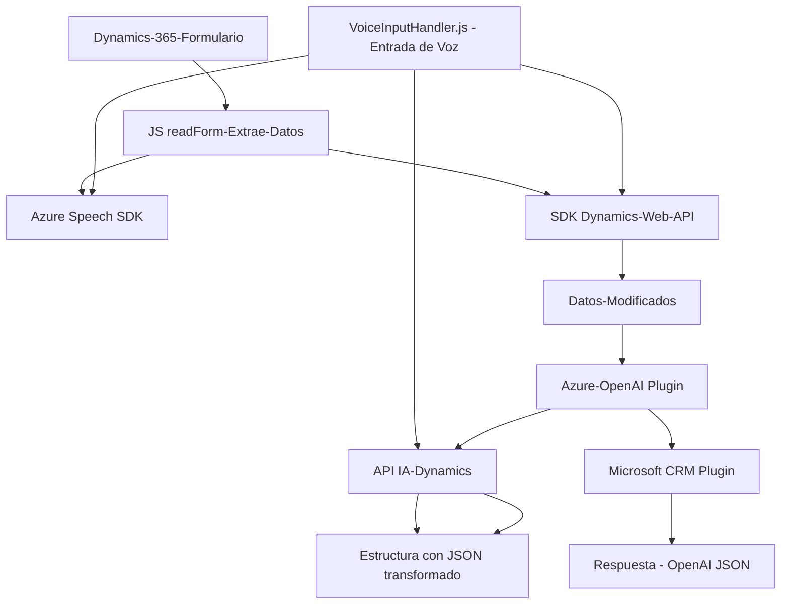

### Breve resumen técnico
El repositorio en cuestión contiene componentes reutilizables orientados al desarrollo y operación en un entorno **Microsoft Dynamics 365**, utilizando servicios de inteligencia artificial y procesamiento de voz a texto con el **Azure Speech SDK** y **Azure OpenAI**. Los archivos están diseñados para una solución que integra reconocimiento de voz, texto a voz, y procesamiento avanzado de texto estructurado. 

---

### Descripción de arquitectura
La arquitectura sigue un patrón de **n capas**, común en soluciones basadas en el ecosistema Microsoft Dynamics. Los componentes están acoplados a un contexto de Dynamics 365 para interactuar con formularios y ejecutar plugins, con comunicaciones hacia servicios de Azure (como OpenAI). Existe una clara distinción entre las capas de interacción con la interfaz (JavaScript para los formularios y modelos de presentación) y las operaciones mediante plugins en el backend del sistema CRM.

1. **Frontend**: La solución proporciona componentes JavaScript para interactuar directamente con formularios y llevar a cabo la manipulación de contenidos en Dynamics 365 a nivel del cliente. Utiliza el **Azure SDK Speech** para funcionalidades de reconocimiento de voz y síntesis de texto a voz.
2. **Backend (Plugins)**: La lógica empresarial se extiende mediante un plugin en C# que utiliza el **Azure OpenAI API** y opera bajo el patrón `Plugin` sobre Dynamics para realizar transformaciones avanzadas de texto.

---

### Tecnologías usadas
1. **Frontend (JS):**
   - **Frameworks/librerías utilizadas**:
     - Azure Speech SDK (gestión de reconocimiento y síntesis de voz).
     - Dynamics 365 Web API (mapeo de datos y manipulación en el contexto del formulario).
   - **Patrones utilizados**:
     - Modularidad y funciones reutilizables.
     - SDK dinámico (carga dinámica del Speech SDK desde la web).
     - Mapeo de datos: Asignación dinámica de campos HTML visibles del formulario a los atributos formales del sistema CRM.

2. **Backend (C#):**
   - **Frameworks/librerías utilizadas**:
     - Microsoft Dynamics CRM SDK (implementación de Plugins).
     - Azure OpenAI API (integración con el modelo GPT).
     - Newtonsoft.Json (manejo y procesamiento estructurado de datos en JSON).
     - System.Text.Json y System.Net.Http para operaciones con APIs.
   - **Patrones utilizados**:
     - Plugin Design Pattern: Extiende la lógica empresarial de Dynamics 365.
     - Facade Pattern: Simplifica la interacción entre Dynamics y Azure OpenAI.

---

### Diagrama **Mermaid**

---

### Conclusión final
El repositorio representa una solución empresarial para integrar la inteligencia artificial y la tecnología de procesamiento de voz en aplicaciones basadas en Microsoft Dynamics 365. La arquitectura combina elementos de **backend** y **frontend**, operando en capas distintas y comunicándose eficientemente con servicios como **Azure Speech** y **Azure OpenAI API**. Aunque se utiliza un enfoque modular, la solución aparece como un monolito dependiente del contexto y estructura específica de Dynamics 365, lo que puede limitar su portabilidad a otros sistemas. Sin embargo, las herramientas seleccionadas y los patrones aplicados (como la integración modular de SDK y el patrón de plug-in en el backend) permiten desarrollar una solución escalable y ajustada para sistemas CRM.