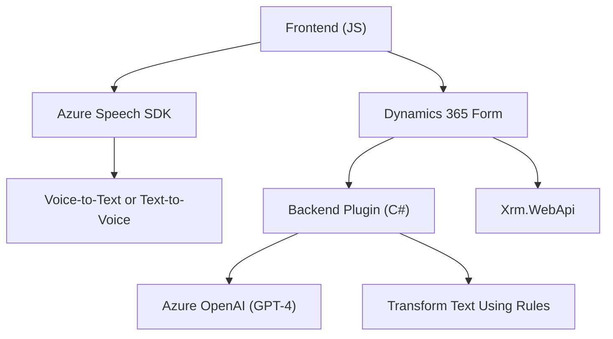

### Breve resumen técnico:
El repositorio presenta una solución integrada que combina un **frontend** en JavaScript diseñado para interactuar con formularios dinámicos, una **lógica de reconocimiento de voz y síntesis de texto** utilizando el **Azure Speech SDK**, y un **plugin de Dynamics 365** escrito en C# que se encarga de transformar texto mediante **Azure OpenAI**. En conjunto, esta solución permite la captura, procesamiento y transformación de datos textuales a través de voz e IA.

---

### Descripción de arquitectura:
La arquitectura tiene un enfoque **n capas** compuesto de:
1. **Capa de presentación**: Frontend en JavaScript que interactúa con el usuario (formulario dinámico) y utiliza botones/eventos para activar la captura de voz y la síntesis de texto.
2. **Capa de integración**: Gestión del SDK de Azure Speech en el frontend y el consumo de una API personalizada para la transformación del texto procesado. También sincroniza elementos del formulario de Dynamics.
3. **Capa de lógica empresarial**: Plugin en C#, desplegado en Dynamics 365, que contiene las reglas y procesos para realizar transformaciones textuales utilizando Azure OpenAI.
4. **Capa de servicios externos**: Dependencia directa de servicios como **Azure Speech SDK** (reconocimiento y síntesis de voz) y **Azure OpenAI** (transformación del texto).

---

### Tecnologías usadas:
1. **Frontend:**
   - **Azure Speech SDK**: Reconocimiento y síntesis de voz.
   - **JavaScript ES6**: Modularidad, programación asincrónica con `async/await`.
   - **Dynamics 365 API**: Para gestionar campos de formularios.
   
2. **Backend (Plugin):**
   - **C#**: Escritura del plugin ejecutado en Dynamics.
   - **Microsoft Dynamics SDK**: Gestión de datos CRM.
   - **Azure OpenAI API**: GPT-4, proceso de transformación textual.
   - **HTTP Client**: Para conectar al servicio de Azure OpenAI.

---

### Dependencias o componentes externos:
1. **Azure Speech SDK**: Se carga dinámicamente en el frontend y permite reconocimiento de voz y síntesis.
2. **Azure OpenAI**: Utilizado por el plugin para transformar texto siguiendo las reglas predefinidas.
3. **Xrm.WebApi**: Dependencia del frontend para interactuar con Dynamics CRM y gestionar campos de formulario.
4. **Microsoft Dynamics SDK**: Librerías para desarrollar plugins y extensiones en Dynamics CRM.
5. **Newtonsoft.Json y System.Text.Json**: Para manipulación de estructuras JSON.

---

### Diagrama **Mermaid** (compatible con **GitHub Markdown**):

---

### Conclusión final:
La solución presentada es una **arquitectura n capas** bien estructurada que combina un frontend para interacción con usuarios y captura de voz, una lógica de negocio en un plugin CRM, y la integración con servicios de IA y voz basados en Azure. El uso de servicios externos como Azure Speech SDK y Azure OpenAI demuestra un patrón **orientado a servicios** y **event-driven programming**. Esto garantiza extensibilidad, modularidad y un enfoque que favorece futuras integraciones.