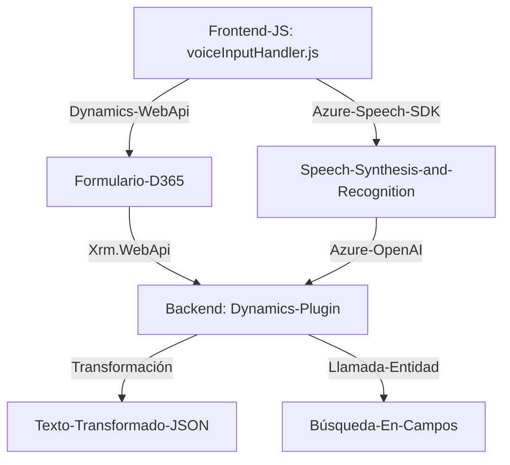

### Análisis del proyecto

#### **Breve resumen técnico**
Este repositorio implementa funcionalidades relacionadas con la integración entre un entorno de Microsoft Dynamics 365, **Azure Speech SDK**, y **Azure OpenAI API**, con el propósito de mejorar la accesibilidad y eficiencia en formularios mediante reconocimiento de voz, síntesis de voz y transformación inteligente de texto. Adicionalmente, utiliza plugins en la capa backend para aplicar reglas específicas sobre textos.

#### **Descripción de arquitectura**
1. **Frontend:** Utiliza archivos JavaScript que integran **Azure Speech SDK** y manipulan formularios en Microsoft Dynamics 365, utilizando el API de Dynamics (`Xrm.WebApi`) para interacción entre el frontend y el backend. Los patrones aplicados en el JavaScript incluyen modularidad y callbacks para operaciones asincrónicas, ejemplo: asegurarse de que SDKs estén cargados antes de utilizarlos.
2. **Backend:** Implementa un plugin basado en **Microsoft Dynamics CRM SDK**, que integra servicios externos como Azure OpenAI API para transformar texto utilizando reglas predefinidas. Este backend utiliza patrones estándar de la arquitectura de plugins de Dynamics, y su ejecución está orientada a eventos configurados en Dynamics 365.
3. **Arquitectura general:** Los componentes descritos se integran bajo una **arquitectura n-capas**, donde el frontend (UX) interactúa con el backend alojado en Dynamics 365. Sin embargo, parte de las operaciones (como integraciones de Azure OpenAI y SpeechSDK) se pueden interpretar como un modelo parcialmente **microservicios**, especialmente en el uso de Azure APIs para funcionalidades específicas.
4. **Patrones y principios:** 
   - **Desacoplamiento:** Las interacciones entre frontend y backend están separadas utilizando APIs y plugins.
   - **Integración de servicios externos:** Gracias a los SDK de Azure (conductores, APIs), el sistema aprovecha servicios externos para funciones especializadas.

#### **Tecnologías usadas**
- **Frontend:**
  - JavaScript y APIs para integrarse con Microsoft Dynamics.
  - **Azure Speech SDK** para texto hablado y reconocimiento de comandos.
  - `window.SpeechSDK` cargado dinámicamente desde la URL externa.
- **Backend:**
  - **C#:** Implementación de plugins usando SDK de Dynamics CRM.
  - Newtonsoft.Json y System.Text.Json para manejar JSON.
  - **Azure OpenAI API** para transformación y procesamiento inteligente de texto.
- **Servicios y plataformas externas:**
  - Azure Speech Services.
  - Microsoft Dynamics Web API.

#### **Dependencias y componentes externos**
1. **Azure Speech SDK**
   - Cargado dinámicamente en el frontend (URL: `https://aka.ms/csspeech/jsbrowserpackageraw`).
   - Sintetiza texto hablado y realiza reconocimiento de comandos.
2. **Microsoft Dynamics Web API**
   - Maneja operaciones con formularios, manipulación de contexto, y búsqueda en CRM.
3. **Azure OpenAI API**
   - Usada en el plugin backend para transformar texto.

---

### **Diagrama Mermaid**

---

### **Conclusión Final**
Este repositorio implementa una solución enfocada en la accesibilidad, basada en la integración entre **Azure Speech SDK**, **Azure OpenAI API**, y **Microsoft Dynamics CRM**. Es una arquitectura predominantemente **n-capas**, combinada con una integración externa de servicios, lo que podría clasificarse parcialmente como **microservicios** en su dependencia de APIs de Azure para funciones específicas. Esta solución es útil para entornos como aplicaciones empresariales donde el manejo de formularios con tecnología asistiva es crucial.