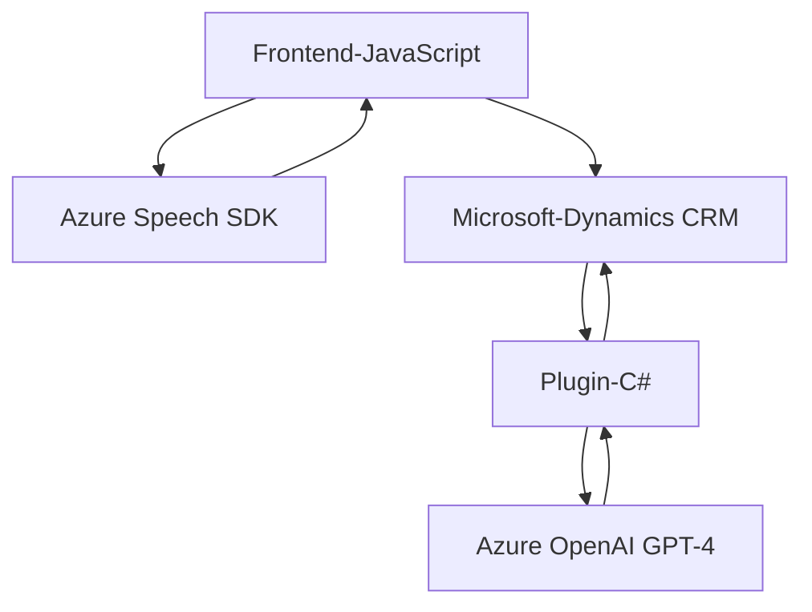

### Breve resumen técnico

El repositorio describe una solución distribuida centrada en la interacción de formularios de Dynamics 365 mediante entrada/salida de voz y procesamiento de texto con IA, utilizando servicios de Azure. Contiene componentes de frontend (JavaScript), lógica de negocio (C#) integrada como plugin en Dynamics, y conexión con servicios externos de Microsoft Azure (Speech SDK y OpenAI).

---

### Descripción de arquitectura

La arquitectura combina **capas de lógica cliente (frontend)** y **backend integrado como plugin**, integrando servicios externos (Azure Speech SDK y Azure OpenAI). La solución sigue un enfoque distribuido pero no completamente separado en microservicios, con una clara separación de responsabilidades:

1. **Frontend** gestiona entrada/salida de voz y vinculación con Dynamics 365.
2. **Backend (plugin)** realiza transformación de datos y procesamiento.
3. Uso de servicios de Azure para voz (Speech SDK) y texto (OpenAI), creando una arquitectura híbrida entre plugins tradicionales y SaaS (Software-as-a-Service).

Prácticamente, la arquitectura puede clasificarse como **n capas** en un contexto distribuido.

---

### Tecnologías usadas

1. **Frontend**:
   - **JavaScript** para manejo de lógica de cliente, manipulación de DOM y SDK Azure Speech.
   - **Azure Speech SDK** (cargado dinámicamente desde URL).
   - **Microsoft Dynamics CRM JavaScript API** para manejo de formularios y datos.

2. **Backend**:
   - **C#** para desarrollo del plugin.
   - **Microsoft Dynamics CRM Plugin Framework (IPlugin)** para integración y manejo de eventos dentro del CRM.
   - **Azure OpenAI GPT-4** para transformación de texto.
   - **Newtonsoft.Json** y **System.Text.Json** para manipulación y serialización de datos JSON.

3. **Servicios Externos**:
   - **Azure Speech SDK**: Procesamiento de voz.
   - **Azure OpenAI (GPT-4)**: Generación de texto estructurado.

### Patrones implementados
- **Cargador dinámico**: Manejo dinámico de SDK externos (Azure Speech).
- **Wrapper Pattern** para encapsular la lógica de SDKs.
- **Builder Pattern** para preparación de datos antes del procesamiento y asignación a formularios.
- **Dependency Injection and Plugin Pattern** para el diseño en C# que permite la integración específica en el pipeline de eventos de Dynamics 365.

---

### Dependencias o componentes externos presentes

1. **Microsoft Dynamics CRM API**:
   - API para manipulación de datos asociados a formularios (incluyendo Web API).

2. **Azure Speech SDK**:
   - Cargado dinámicamente desde URL específica, para el procesamiento de voz.

3. **Azure OpenAI GPT-4**:
   - Utilizado mediante solicitudes HTTP para procesar y transformar texto en JSON estructurado.

4. **Librerías externas en C#**:
   - `Newtonsoft.Json.Linq` y `System.Text.Json` para JSON.
   - `System.Net.Http` para solicitudes HTTP.

---

### Diagrama Mermaid

A continuación, se presenta un diagrama de flujo general que describe la interacción entre los componentes del sistema. Este diagrama sigue las reglas establecidas y es apto para repositorios en GitHub.

---

### Conclusión final

La solución descrita en el repositorio es una aplicación distribuida integrada principalmente en plataformas de Microsoft, destacando una implementación híbrida que combina una arquitectura de **n capas** y fortalezas de microservicios (interacción con servicios SaaS externos). Los estándares de desarrollo incluyen patrones avanzados para integración, encapsulación, y reconexión con APIs externas, lo que le otorga modularidad, escalabilidad y eficiencia en recursos.  

El uso de tecnologías como Azure Speech SDK y OpenAI GPT-4 posiciona esta solución como innovadora para automatizar la interacción mediante voz y la transformación de datos con IA en Dynamics 365.