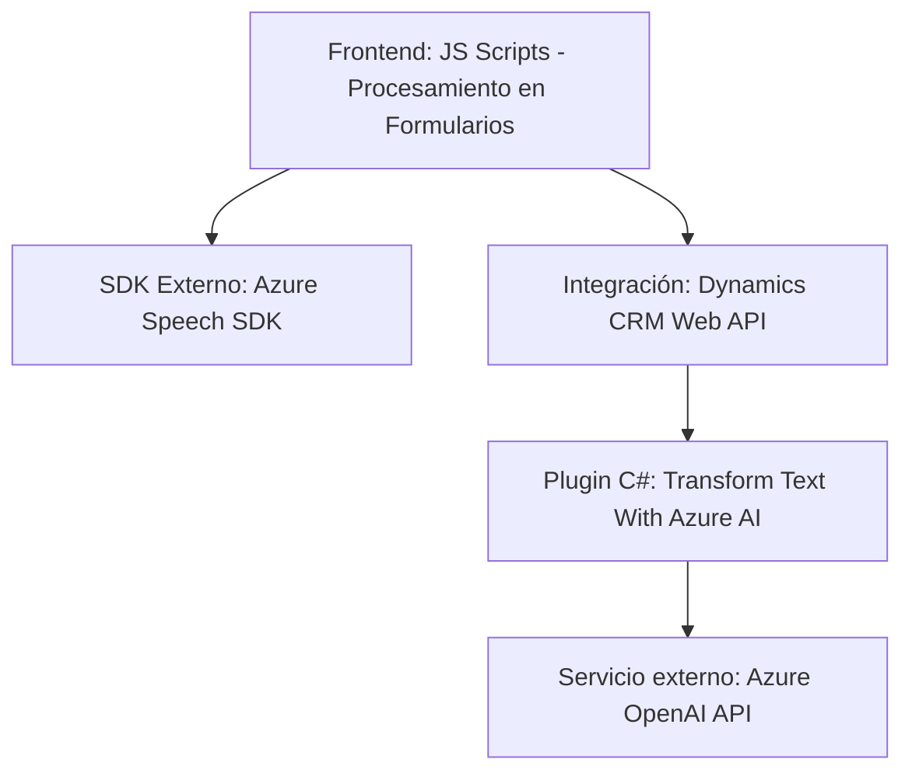

### Resumen técnico
El repositorio es una solución híbrida que combina:
- **Frontend/JS**: Scripts que integran funcionalidad de interacción de voz (Azure Speech SDK) y procesamiento de datos en formularios de Dynamics CRM.
- **C# Plugin**: Extensión personalizada para Dynamics CRM que utiliza Azure OpenAI para transformar texto y aplicarlo en CRM.

---

### Descripción de arquitectura
La arquitectura principal es **híbrida** basada en múltiples capas y estilos. Se utiliza:
1. **Frontend Layer**:
   - Scripts JavaScript implementados en Dynamics CRM para interactuar con formularios.
   - Integración asíncrona con SDKs y APIs externas.
2. **Backend Layer**:
   - Plugins de Dynamics CRM (C#) que actúan como extensiones para procesamiento de datos (Azure AI/OpenAI).

La solución muestra características comunes de:
- **Arquitectura de n capas**: Separación entre frontend (cliente), lógica de negocio (SDK y plugins), y backend (Dynamics CRM y Azure AI).
- **Integración de servicios externos**: Uso de Azure Speech SDK para síntesis de voz y Azure OpenAI para procesamiento avanzado de texto.

---

### Tecnologías utilizadas
1. **JavaScript**:
   - Aplicaciones: Interacción con formularios de Dynamics CRM, procesamientos de voz, mapeo de datos.
   - Framework notable: Referencias a Dynamics CRM mediante APIs como `Xrm.WebApi`.
   - Dependencia externa: Azure Speech SDK.
2. **Azure Speech SDK** para síntesis y transcripción de texto a voz.
3. **Microsoft Dynamics CRM Web API (Xrm)** para gestión de datos en formularios dinámicos.
4. **C# (.NET Framework)**:
   - Extensión de Dynamics CRM mediante `Microsoft.Xrm.Sdk` para creación de plugins.
   - Comunicación con Azure OpenAI utilizando `System.Net.Http`.
5. **Azure OpenAI**:
   - Tecnología avanzada en procesamiento de texto (GPT-4).
   - JSON estructurado para integración con formularios mediante C#.

---

### Diagrama Mermaid (válido para GitHub Markdown)

---

### Conclusión final
Este repositorio implementa una solución muy enfocada en **Microsoft Dynamics CRM**, diseñada como una arquitectura de **n capas** que integra frontend y backend con servicios externos. En el frontend, los scripts JavaScript conectan formularios dinámicos con el servicio de reconocimiento y síntesis de voz de Azure Speech SDK, permitiendo la interacción por voz. En el backend, los plugins C# extienden las funcionalidades de CRM, procesando datos a través de Azure OpenAI.

En general, esta solución es un ejemplo efectivo de cómo integrar **inteligencia artificial** y **servicios externos** (Azure Speech y OpenAI) dentro de un sistema corporativo basado en Dynamics CRM. Hay una buena separación de las responsabilidades y un excelente uso de herramientas modernas, aunque podría beneficiarse de una optimización adicional en la gestión de configuraciones (como claves de API).