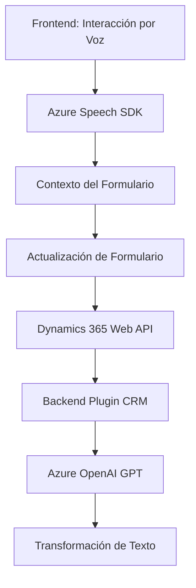

### Breve Resumen Técnico
El repositorio presenta componentes relacionados con: 
- **Frontend:** Integración de formularios con entrada de voz y síntesis mediante Azure Speech SDK.
- **Backend:** Plugin de Dynamics CRM que utiliza el Azure OpenAI API para procesar y formatear texto.

La solución tiene una arquitectura que combina múltiples tecnologías y patrones, apuntando hacia una arquitectura de integración de servicios, donde el frontend se conecta con APIs en Dynamics CRM y servicios de Azure.

---

### Descripción de arquitectura
La solución combina dos capas principales:
1. **Frontend:** Implementado en JavaScript, el frontend interactúa con formularios y el Azure Speech SDK. Se encarga de capturar datos visuales de los formularios o usar comandos de voz para actualizar dinámicamente esos datos.
2. **Backend:** Plugins en Dynamics CRM que se integran con Azure OpenAI para transformar textos conforme a reglas personalizadas definidas. Este diseño hace uso del **plugin pattern** por Dynamics 365 y de tecnologías REST para la integración con Azure.

Se evidencia una arquitectura **orientada a servicios** (SOA) con integración externa y comunicación entre varias capas:
- Widgets operan como cliente de formularios y servicios SDK con tecnología web.
- Plugins funcionan como middleware entre Dynamics 365 y Azure OpenAI API.

---

### Tecnologías, Frameworks y Patrones
#### **Frontend:**
1. **Azure Speech SDK:** Proceso de síntesis y reconocimiento de voz basado en servicios cloud de Microsoft.
2. **JavaScript Modular:** Funciones independientes, con modularidad clara (cada función cumple un rol específico).
3. **MVC (frontend):** Uso implícito del patrón MVC, con énfasis en el manejo de datos del formulario (Modelo) y actualización dinámica de UI (Controlador).

#### **Backend (Plugins):**
1. **C# .NET:** Desarrollo del plugin en el framework Dynamics.
2. **Azure OpenAI API:** Uso de REST API para transformar texto en formatos específicos con soporte GPT.
3. **Plugin Pattern:** Expansión basada en interfaces para mejorar Dynamics CRM.
4. **Service-Oriented Architecture (SOA):** Plugins y APIs interconectados.

#### Patrones Comunes:
- **Factory Method:** Creación dinámica de configuraciones como `SpeechConfig` en frontend y manejo de payloads en backend.
- **Delegación:** Uso de callbacks para cargar dinámicamente el Speech SDK.
- **State Management:** Actualización de elementos del formulario basado en comandos.
- **Abstract Factory:** Manejo de datos transcritos y modulares en múltiples formatos.

---

### Dependencias y Componentes Externos
1. **Azure Speech SDK:** Para procesamiento de voz (síntesis, transcripción).
2. **Azure OpenAI API:** Para procesamiento avanzado de texto utilizando modelos como GPT.
3. **Dynamics 365 Web APIs (Xrm.WebApi):** Interacción con servicios y modelos de Dynamics CRM.
4. **Microsoft SDK (CRM):** APIs para extensiones en plugins (`IPlugin`, `IOrganizationService`).
5. **Frameworks de serialización:** 
   - `System.Text.Json`
   - `Newtonsoft.Json`

---

### Diagrama Mermaid

---

### Conclusión Final
La solución combina inputs de voz y síntesis de texto en un **frontend**, conectándose con APIs de Dynamics 365 y servicios cloud de Azure. Su backend complementa esto con un plugin dedicado que integra el procesamiento avanzado de texto a través de Azure OpenAI, demostrando una arquitectura orientada a **integración de servicios** que aprovecha tecnologías cloud y patrones modernos. Aunque modular y bien integrada, puede optimizarse con una implementación más segmentada de microservicios para desacoplar plugins y entradas cliente.