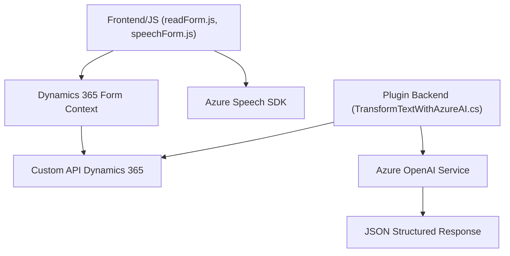

### Breve resumen técnico

Los archivos analizados pertenecen a integraciones basadas en la plataforma **Microsoft Dynamics CRM**, enfocadas en formularios dinámicos, entrada de voz y procesamiento de texto con inteligencia artificial. La solución integra componentes frontend desarrollados en JavaScript con Dynamics 365, y también un componente backend escrito en C# que utiliza un plugin para consumir servicios de Azure AI. La funcionalidad principal del sistema abarca la extracción de datos de formularios visibles, síntesis y transcripción de voz, y transformación de texto en objetos estructurados JSON mediante IA.

---

### Descripción de arquitectura

La arquitectura general es **orientada a servicios** con componentes híbridos:

1. **Frontend/JS**:
   - Encargado de la interacción con formularios en Dynamics 365.
   - Modularidad y gestión dinámica de dependencias externas (Azure Speech SDK) para entrada/salida de voz.
   - Estructura basada en funciones en lugar de clases.

2. **Plugins/Backend**:
   - Plugin en C# conectado directamente al sistema Dynamics 365.
   - Implementa el patrón **Service Gateway** para encapsular las llamadas hacia el servicio de Azure OpenAI.
   - Usa dependencias dinámicas para JSON manipulación y solicitudes HTTP.

La solución tiene características de una arquitectura **multicapa**:
- **Capa de presentación**: Acceso y manipulación de datos desde el DOM en formularios Dynamics.
- **Capa de lógica**:
  - JavaScript para procesamiento en el frontend.
  - C# (plugin) para procesamiento en el backend.
- **Capa de integración externa**: Servicios de Azure AI y Azure Speech.

---

### Tecnologías usadas

- **Frontend**:
  - JavaScript (sin uso explícito de frameworks).
  - Azure Speech SDK: Tecnologías cognitivas para voz-síntesis y transcripción.
  - Dynamics 365 Web APIs (`executionContext`): Manipulación de datos de formularios.

- **Backend**:
  - Microsoft Dynamics CRM SDK (__`IPlugin`__, __`OrganizationService`__).
  - Azure OpenAI via HTTP Client.
  - NewtonSoft JSON y System.Text.Json para procesar objetos JSON.

---

### Diagrama Mermaid válido para GitHub

---

### Conclusión final

Este sistema representa una solución de integración rica entre tecnologías de Microsoft Dynamics CRM y servicios de Azure AI, donde la funcionalidad principal incluye entrada, procesamiento de datos de voz, y transformación de texto por IA. La arquitectura es híbrida (compuesta por multicapa y adaptaciones orientadas a servicios) optimizada para entornos empresariales dinámicos. Las dependencias externas como Azure Speech SDK y Azure OpenAI potencian las capacidades de interacción y análisis del sistema, mientras que la modularidad en frontend/backend lo hace extensible. Puntos de mejora podrían enfocarse en la gestión segura de credenciales y optimización de carga de dependencias externas.