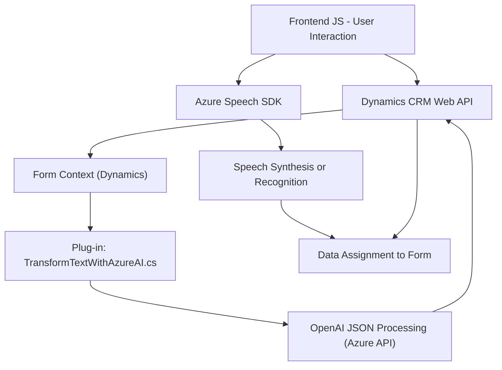

### Breve Resumen Técnico  

El repositorio contiene una solución basada en múltiples capas orientadas a integrar servicios externos, específicamente Azure Speech SDK y Azure OpenAI API, dentro de un entorno de CRM (Dynamics 365). Los archivos evidencian diferentes responsabilidades, como manejo de entrada de voz, procesamiento de datos en formularios y un plugin para transformar texto mediante IA.  

### Descripción de Arquitectura  

La solución utiliza una **arquitectura de capas** y está organizada modularmente. Cada archivo sigue patrones claros de separación de responsabilidades:  
1. La capa de frontend se encarga de interactuar con el usuario mediante formularios, captación de voz, y manejo de datos en el navegador.  
2. La capa de plugins, alojada en el CRM, implementa lógica personalizada que interactúa con APIs externas (Azure OpenAI).  
3. Se sigue un modelo **n capas**, donde el frontend y plugins se integran con **APIs externas** y forman parte de un sistema empresarial en Dynamics 365.  
4. También se observa integración de patrones de **microservicios**, dado el uso de Azure APIs para realizar tareas específicas (reconocimiento de voz y transformación de texto).  

### Tecnologías Usadas  

1. **Backend Plugin (C#):**  
   - `Microsoft.Xrm.Sdk`: Framework para extensibilidad en Dynamics CRM.  
   - `Newtonsoft.Json`: Manipulación avanzada de objetos JSON.  
   - `System.Net.Http`: Comunicación REST con servicios externos.  
   - `Azure OpenAI API`: Servicio de transformación de texto con modelos GPT.  

2. **Frontend (JavaScript):**  
   - **Azure Speech SDK:** Reconocimiento y síntesis de voz.  
   - **Dynamics CRM Web API:** (Xrm.WebApi) Integra los datos dentro del contexto de formularios de CRM.  

3. **Dependencias Externas:**  
   - Servicios Azure: Azure Cognitive Services (Speech y OpenAI).  
   - Scripts remotos cargados dinámicamente para el SDK de Azure.  

### Diagrama Mermaid  

### Conclusión Final  

La solución es un sistema híbrido basado en un modelo de **n capas**, con trazas de **microservicios** debido a la integración con servicios externos especializados como Azure Cognitive Services (Speech SDK y OpenAI). El diseño está claramente segmentado entre frontend (interacción con usuario) y backend (procesos en el CRM), utilizando patrones claros de modularización, integración con APIs y manejo dinámico de dependencias.  

Esta arquitectura es adecuada para entornos empresariales que requieren alta personalización y dinamismo en funciones como interacción de voz y procesamiento inteligente de datos.