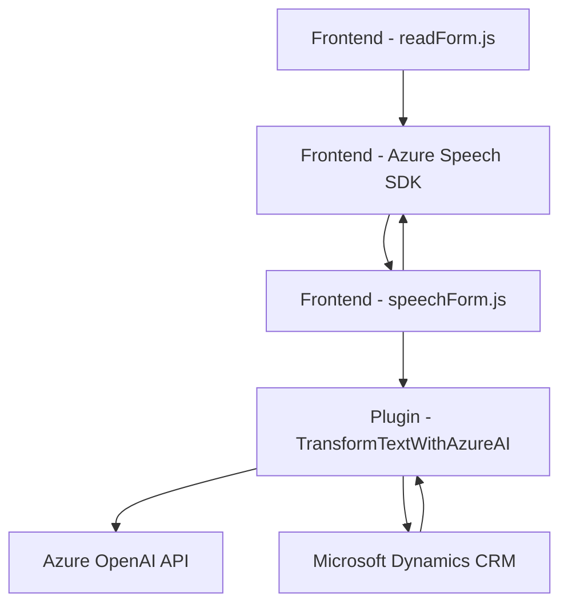

### Breve Resumen Técnico

El repositorio parece ser parte de una solución enfocada en **formularios web dinámicos** integrados con servicios de **Azure** y **Microsoft Dynamics**. Incluye lógica para:
- **Síntesis de texto a voz:** Convertir datos de formularios web en mensajes hablados mediante **Azure Speech SDK**.
- **Reconocimiento de voz:** Transcribir comandos de voz en texto y mapearlos a campos del formulario.
- **Transformación de datos mediante IA:** Utilizar API de **Azure OpenAI** para procesar datos y devolver resultados estructurados.

La solución combina un **frontend basado en JavaScript** para interacción directa con el usuario y un **plugin backend desarrollado en C#** para operaciones específicas con Dynamics CRM.

---

### Descripción de Arquitectura

La arquitectura combina estilos de **cliente-servidor** y **n-capas**, con los siguientes componentes principales:
1. **Frontend (JavaScript)**: Implementa funcionalidades de interacción con el usuario, como captura de voz y síntesis de texto. Utiliza servicios externos como **Azure Speech SDK** y APIs de Dynamics CRM.
2. **Backend Plugin (C#)**: Actúa como un conector entre Dynamics CRM y servicios externos como **Azure OpenAI API** para la transformación de datos.
3. **APIs externas**:
   - **Azure Speech SDK** para sintetizar texto a voz y convertir voz en texto.
   - **Azure OpenAI API** para procesamiento avanzado con inteligencia artificial.

El diseño favorece la modularidad y la separación de responsabilidades: cada componente realiza una tarea bien definida como extracción/transformación de datos, síntesis de voz, o reconocimiento de comandos de voz.

---

### Tecnologías Usadas

#### Lenguajes y Frameworks:
1. **JavaScript (ES6)**:
   - Es usado en los archivos de frontend (`readForm.js`, `speechForm.js`, etc.) para manejar eventos y lógica del cliente.
2. **C# (.NET Framework)**:
   - Utilizado para el desarrollo del plugin compatible con Dynamics CRM.
   
#### Servicios Externos:
- **Azure Speech SDK**: Usado para capacidades de síntesis de voz y reconocimiento.
- **Azure OpenAI API**: Utilizado para transformar texto en datos procesados usando inteligencia artificial.
- **Microsoft Dynamics SDK**: Para modificar datos en formularios y entidades dentro del sistema CRM.

#### Patrones:
1. **Modularidad**: Código estructurado por responsabilidad en funciones, métodos y clases desacopladas para el frontend y el backend.
2. **Cliente-Servidor**: La solución separa la lógica del cliente (frontend) y del servidor (plugin de CRM y APIs).
3. **N-capas**: Al incluir un frontend, middleware (API), y backend, hay una clara división funcional.
4. **Integración de servicios externos**: Uso de SDKs y APIs para interactuar con servicios de terceros.

---

### Dependencias o Componentes Externos

1. **Azure Speech SDK**: Biblioteca para la síntesis de voz y reconocimiento de voz.
2. **Azure OpenAI API**: Para capacidades avanzadas de transformación de texto basado en IA.
3. **Microsoft Dynamics SDK**: Para interactuar con formularios y datos del CRM.
4. **Libraries de .NET**: Para utilidades como `HttpClient` y gestión de JSON con `Newtonsoft.Json`.
5. Posibles frameworks/entornos para el frontend:
   - Puede estar ejecutándose localmente o en un navegador compatible con **ES6** y librerías de JavaScript dinámico.

---

### Diagrama Mermaid

---

### Conclusión Final

La solución representa una integración avanzada que utiliza servicios de inteligencia artificial y síntesis/reconocimiento de voz para enriquecer la experiencia de interacción con formularios web conectados a Microsoft Dynamics CRM. Las tecnologías clave son **Azure Speech SDK**, **Azure OpenAI API**, y la **Microsoft Dynamics API**. La arquitectura sigue un enfoque de cliente-servidor y n-capas con alta modularidad y uso extensivo de servicios externos. Esto facilita la escalabilidad y flexibilidad, con posibilidad de integración futura de más servicios inteligentes.

Sin embargo, el código podría beneficiarse de una mayor abstracción en elementos como el manejo de errores y desacoplamiento de dependencias externas para mejorar el mantenimiento y extensibilidad.