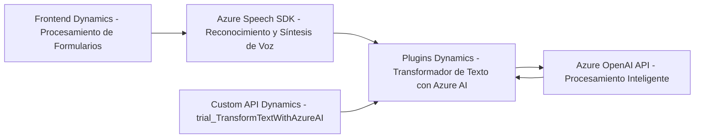

### Breve Resumen Técnico:
El repositorio alberga un sistema integrado que conecta un **frontend JavaScript**, un **backend de plugins para Dynamics CRM**, y tecnologías de Microsoft Azure (Azure Speech SDK y Azure OpenAI). Su funcionalidad principal es la captura de datos desde formularios, entrada de voz, y transformación de texto usando inteligencia artificial. Los módulos están bien modularizados y diseñados para interactuar con servicios externos, especialmente Azure.

### Descripción de Arquitectura:
1. **Tipo de Solución**:
   Es un sistema **multicapas**, compuesto por:
   - **Frontend** interactivo basado en JavaScript, diseñado para formularios en Dynamics CRM.
   - **Plugins integrados en Dynamics CRM**, que actúan como componentes backend para procesamiento de datos mediante Azure OpenAI.
   - Dependencias externas: Azure Speech API (procesamiento de voz) y OpenAI sobre Azure (procesamiento de texto).

2. **Arquitectura General**:
   - **Tres capas (3-tier)**:
     - **Frontend**: Captura de datos y ejecución del SDK de Azure Speech en el navegador.
     - **Backend (Plugins en Dynamics CRM)**: Procesamiento avanzado con Azure OpenAI y actualización de datos en el CRM.
     - **Servicios externos**: Comunicación directa con Azure Speech API y Azure OpenAI API.
   - **Integración basada en eventos**: Reconocimiento de voz y procesamiento de texto mediante flujos asincrónicos.
   - **Modularización**: Los módulos están organizados para manejar cada responsabilidad de forma aislada.

3. **Patrones utilizados**:
   - **Carga dinámica del SDK**: El frontend carga el Azure Speech SDK según demanda con la función `ensureSpeechSDKLoaded`.
   - **Microservicio-like en plugins**: El plugin `TransformTextWithAzureAI` actúa como un servicio backend, transformando datos usando Azure OpenAI y respondiendo en formato estructurado JSON.
   - **Middleware y Promesas**: Uso intensivo de promesas para invocar APIs externas y servidores de CRM.

### Tecnologías Usadas:
- **Frontend**:
  - JavaScript.
  - Azure Speech SDK para síntesis y reconocimiento de voz.
  - Dynamics CRM API (`Xrm.WebApi`) para la interacción con formularios y entidades.
- **Backend (Dynamics CRM Plugins)**:
  - .NET Framework (`Microsoft.Xrm.Sdk` y `Newtonsoft.Json`).
  - Azure OpenAI API.
- **Servicios Externos**:
  - Azure Speech API.
  - Azure OpenAI.
- **Frontend Dynamic Loading**:
  - Carga el SDK desde URL (`https://aka.ms/csspeech/jsbrowserpackageraw`).

### Dependencias o Componentes Externos:
1. **Azure Speech SDK**:
   - Para convertir texto a voz y procesar entrada de voz.
   - Proporcionado dinámicamente a través de una URL pública.
2. **Azure OpenAI API**:
   - Gestión avanzada de datos y generación de JSON basado en texto de entrada.
   - Endpoint: `https://openai-netcore.openai.azure.com/`.
3. **Dynamics CRM API (Xrm.WebApi)**:
   - Actualización de campos de formulario.
   - Uso de entidades lookup y Custom API (`trial_TransformTextWithAzureAI`).

---

### Diagrama Mermaid válido para GitHub:

---

### Conclusión Final:
Este repositorio implementa una solución de **integración avanzada entre Dynamics CRM y Azure**, orientada al procesamiento de voz y transformación inteligente de texto. Su arquitectura sigue un enfoque **multicapas** bien estructurado, con patrones modernos como carga dinámica, modularización y eventos asincrónicos.

Aunque funcionalmente robusto, una posible mejora sería la implementación de **mejores prácticas de seguridad** (por ejemplo, manejo centralizado de claves API a través de Azure Key Vault) y una optimización para la extensibilidad del plugin en Dynamics CRM.