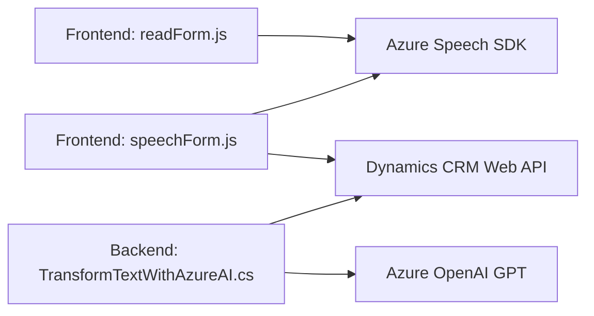

# Análisis de la solución

## Breve resumen técnico
El repositorio contiene tres archivos que implementan funcionalidades específicas relacionadas con la interacción entre usuarios y formularios de Dynamics CRM utilizando tecnologías avanzadas como Azure Speech SDK y Azure OpenAI. Los archivos son:

1. **readForm.js**: Lee datos visibles de formularios y los convierte en audio mediante Azure Speech SDK.
2. **speechForm.js**: Procesa la entrada de voz, transcribe y asocia los valores reconocidos con campos en el formulario del CRM.
3. **TransformTextWithAzureAI.cs**: Plugin de Dynamics CRM que transforma texto con Azure OpenAI GPT y genera una salida estructurada.

El objetivo general de la solución es automatizar la interacción humana con formularios y aumentar la eficiencia en procesos de ingreso y lectura de datos.

---

## Descripción de arquitectura
La solución utiliza una **arquitectura híbrida orientada a servicios**. Aunque los archivos funcionan de manera modular y principalmente en el frontend, el uso del plugin de Dynamics CRM con llamadas a servicios web de Azure (como Azure Speech SDK y Azure OpenAI API) refleja un patrón de microservicios. Este enfoque robusto centraliza la lógica de negocio en componentes escalables integrados con API externas.

Por otro lado, los componentes de JavaScript que se ejecutan en el frontend muestran principios de una arquitectura modular y en capas:
1. La capa de datos del formulario (entrada y salida) es manejada en el contexto de CRM.
2. Los callbacks cargan dinámicamente dependencias como el SDK de Azure Speech, asegurando su ejecución en caso de interacción con la voz.

En su conjunto, la incorporación de tecnologías externas (Azure AI, Dynamics CRM) y elementos modulares en frontend indica una mezcla entre **n capas y microservicios**.

---

## Tecnologías usadas
1. **Frontend**:
   - **JavaScript**: Para la manipulación de DOM y la integración con Azure Speech SDK.
   - **Azure Speech SDK**: Conversión de texto en audio y reconocimiento de comandos de voz.
   - **HTML APIs**: Uso de la manipulación del DOM y eventos del navegador.

2. **Backend (Plugin)**:
   - **C#**: Para el desarrollo de un plugin en Dynamics CRM.
   - **Dynamics CRM SDK (Microsoft.Xrm.Sdk)**: Conexión y acceso a eventos y datos del CRM.
   - **Azure OpenAI GPT**: Procesamiento avanzado para transformar texto en JSON estructurado.
   - **Newtonsoft.Json**: Manejo de objetos JSON.

---

## Diagrama Mermaid
El diagrama muestra los componentes clave, las dependencias y las relaciones entre ellos:

---

## Conclusión final
La solución corresponde a un sistema híbrido que aprovecha las capacidades de Azure AI y Dynamics CRM para automatizar la interacción de los usuarios con formularios mediante voz. Usa una arquitectura modular y flexible, en parte con patrones de microservicios para integrar servicios externos y en capas para flujo interno. Su diseño permite escalabilidad y extensibilidad en entornos empresariales, facilitando la comunicación entre frontend, backend y APIs externas.