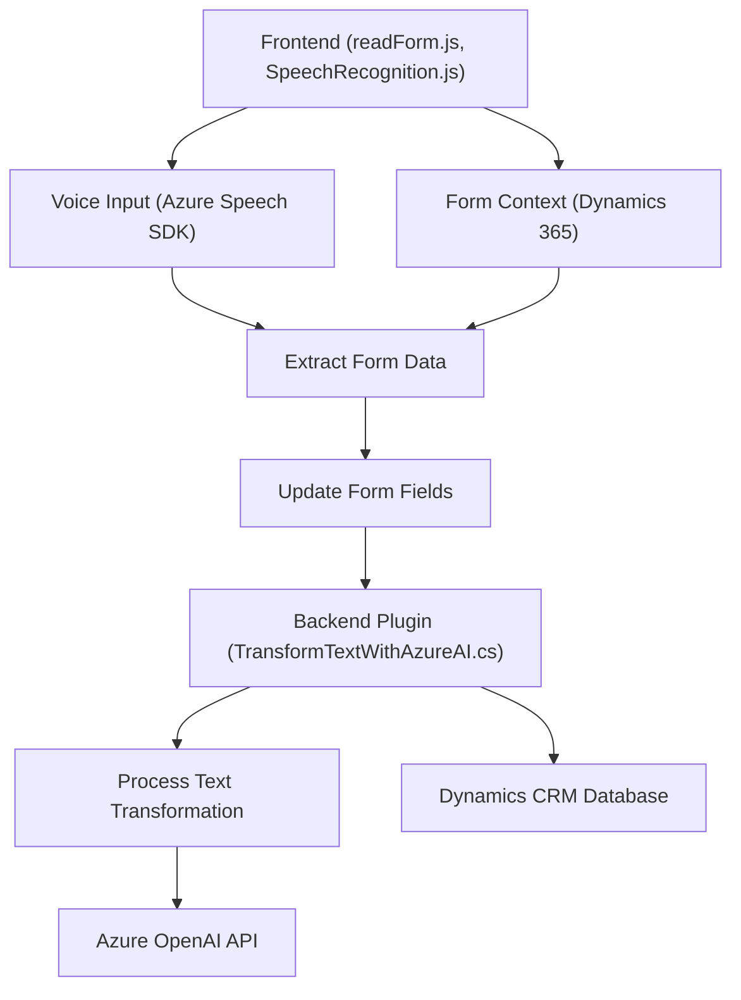

### Breve resumen técnico

Este repositorio consiste en un conjunto de archivos que implementan funcionalidades relacionadas con el manejo de voz y texto mediante el uso de tecnologías Microsoft Azure, Dynamics 365, y Azure OpenAI. Los archivos se focalizan en integrar capacidades avanzadas de inteligencia artificial y reconocimiento de voz con formularios dinámicos de CRM. Esto se logra mediante servicios en la nube y patrones modulares que favorecen la separación de responsabilidades.

---

### Descripción de arquitectura

La solución se organiza como un ecosistema de herramientas que interactúan formando una solución aplicada sobre un sistema existente (Dynamics 365). La arquitectura predominante es ligeramente orientada a **n-capas modular**, con una clara separación entre presentación, lógica de negocio, y servicios externos.

Además, los archivos hacen uso de integraciones basadas en APIs externas (Azure Speech SDK y Azure OpenAI), lo que extiende las capacidades del sistema CRM para manejar transcripciones de voz y transformaciones textuales. Los componentes principales son:

1. **Frontend (readForm.js y speechForm.js):** Implementa la interfaz de usuario que interactúa con formularios visibles en Dynamics 365. Utiliza librerías de Azure Speech SDK para habilitar entrada, transcripción, y síntesis de voz.
2. **Backend (TransformTextWithAzureAI.cs plugin):** Extiende la funcionalidad del CRM mediante un plugin que utiliza Azure OpenAI para procesar y transformar textos.
3. **APIs externas:** Los servicios de Azure Speech y Azure OpenAI se emplean como componentes especializados de la solución.

La interacción de los componentes indica que esta solución tiene características de una arquitectura **event-driven** al procesar inputs en tiempo real, además de integración **cloud-first** para usar servicios avanzados del ecosistema Azure.

---

### Tecnologías usadas

1. **Microsoft Azure Speech SDK:**
   - Reconocimiento de voz y síntesis de texto a voz.
   - Servicios de análisis y generación de texto.
2. **Dynamics 365 SDK:** 
   - Utilización de la API de Dynamics 365 para integrar capacidades con formularios.
   - Uso del contexto de ejecución específico de Dynamics.
3. **Azure OpenAI API:**
   - Utilizado para realizar transformaciones de texto mediante un modelo GPT (Inteligencia Artificial).
   - Procesamiento de datos y generación de estructuras JSON basadas en normas.
4. **JavaScript:**
   - Principal lenguaje para habilitar la lógica de cliente asociada a los formularios de Dynamics.
5. **Microsoft.Crm.Sdk:** Interacción con el entorno CRM para realizar operaciones backend.
6. **API Integration:** Interacción remota y segura con servicios externos utilizando APIs y autenticación.

---

### Diagrama Mermaid válido para GitHub

---

### Conclusión final

Esta solución muestra una arquitectura **modular y basada en eventos**, con una clara separación entre frontend (para la interacción con los usuarios), backend (para procesamiento y transformación de datos), y servicios externos (Azure Speech SDK y Azure OpenAI API). La implementación en Dynamics 365 CRM permite construir flujos de trabajo personalizados y ampliar las capacidades del sistema mediante inteligencia artificial. Esta integración aprovecha patrones modernos como el uso de APIs y cloud-first, haciendo de esta solución una implementación avanzada y flexible adecuada para escenarios empresariales.