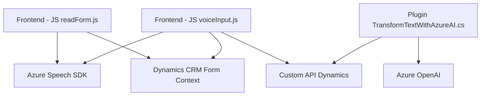

### Breve resumen técnico
El repositorio analizado parece formar parte de una solución que integra reconocimiento de voz, procesamiento de formularios basados en Microsoft Dynamics CRM y transformación de texto con inteligencia artificial proporcionada por Azure OpenAI y Azure Speech SDK. Los archivos principalmente interactúan con formularios dinámicos del CRM, presentando patrones de modularidad y adaptadores para conexiones externas.

---

### Descripción de arquitectura
1. **Tipo de solución:**
   - **Archivo JavaScript (`readForm.js`):** Frontend vinculado a un sistema de reconocimiento y síntesis de voz.
   - **Archivo JavaScript (`voiceInput.js`):** Frontend vinculado a un sistema de transcripción basado en Azure Speech SDK, integrado con Dynamics CRM.
   - **Archivo C# (`TransformTextWithAzureAI.cs`):** Plugin backend de Microsoft Dynamics CRM para transformar texto con Azure OpenAI.

2. **Tipo de arquitectura:**
   - **Frontend:** Modular, interactúa con servicios externos como Azure Speech SDK y APIs de CRM utilizando un patrón multicapa (acción/control/servicio).
   - **Backend (plugin en C#):** Patrón basado en **Plug-in Architecture** de Dynamics CRM para lógica extendida. Puede considerarse como una estructura SOA (orientada a servicios) acoplada al CRM, con un enfoque hacia microservicios debido a la integración con Azure AI.

3. **Patrones usados:**
   - **Modularidad:** Cada archivo está organizado en funciones y clases específicas con roles claramente definidos.
   - **Adaptador:** Los plugins y scripts hacen uso de adaptadores para interactuar con APIs externas como Azure Speech SDK y Dynamics CRM APIs.
   - **Carga dinámica de dependencias:** En el frontend, el SDK de Azure Speech se carga de forma asincrónica.
   - **Composición funcional:** En los scripts de frontend, las funciones pequeñas se combinan para realizar procesos completos.
   - **Plug-in Architecture:** En el backend, `TransformTextWithAzureAI` implementa la interfaz estándar `IPlugin` para extender la funcionalidad del CRM.

4. **Componentes externos presentes:**
   - **Azure Speech SDK:** Para reconocimiento y síntesis de voz.
   - **Azure OpenAI API:** Para transformación textual.
   - **Microsoft Dynamics CRM Web API:** Para manipulación de formularios y datos en una solución empresarial.

---

### Tecnologías usadas
- **Frontend (JS):**
  - Azure Speech SDK (`window.SpeechSDK`).
  - DOM API para manipulación de formularios.
  - Microsoft Dynamics CRM APIs para integración con contexto de ejecución.
  
- **Backend (C#):**
  - Microsoft Dynamics CRM SDK:
    - `Microsoft.Xrm.Sdk` para acceso al contexto de ejecución del plugin.
  - `System.Net.Http` para llamadas HTTP a Azure OpenAI.
  - `System.Text.Json` y `Newtonsoft.Json.Linq` para manejo JSON.
  - Azure servicios:
    - Speech SDK.
    - OpenAI API para GPT-4.

---

### Diagrama Mermaid

---

### Conclusión final
El proyecto arquitectónico es una solución orientada a la interacción con usuarios mediante formularios dinámicos de Microsoft Dynamics CRM. Utiliza tecnologías de Azure para síntesis y transcripción de voz, así como transformación de texto con inteligencia artificial. La arquitectura es un híbrido entre patrones de software modular y enfoques modernos de microservicios adaptados para integrar servicios externos, destacando una eficiente segmentación de responsabilidades en frontend y backend. La integración con los servicios de Azure asegura escalabilidad y potencia en la ejecución de funcionalidades avanzadas.