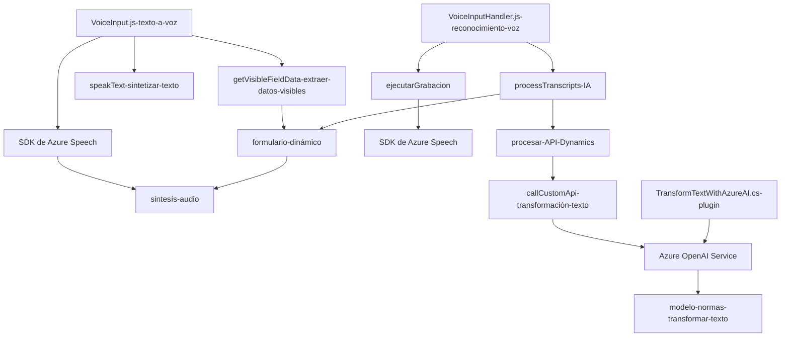

# Análisis Técnico del Repositorio

**Breve resumen técnico:**
El repositorio implementa componentes de una solución híbrida que integra reconocimiento de voz, síntesis de texto a voz, procesamiento de datos en formularios dinámicos, y transformación de texto basado en IA con servicios de Azure. Los archivos indican un enfoque tanto en frontend (JavaScript) como en backend (Plugins para Dynamics CRM) con dependencias externas clave como Azure Speech SDK y Azure OpenAI.

---

### **Descripción de arquitectura:**
1. **Tipo de solución**:
   - Combinación de frontend y backend (integración para un entorno Dynamics CRM).
   - Ofrece capacidades de reconocimiento de voz, texto a voz (frontend) y generación/transformación de datos (backend).

2. **Tipos de arquitectura:**
   - **Frontend:** Estructura modular:
     - Funcionalidades de texto a voz y reconocimiento de entrada por voz están estructuradas en funciones autónomas con carga dinámica del SDK de Azure Speech.
   - **Backend:** Arquitectura basada en el modelo de **plugins** de Dynamics CRM:
     - Modela eventos específicos del sistema, como procesamiento de texto en formulaciones JSON mediante la API de OpenAI (Azure).

3. **Patrones arquitectónicos detectados:**
   - **Modularización funcional:** En el frontend, las responsabilidades están distribuidas por funciones independientes como extracción de datos de formularios (`getVisibleFieldData`) y síntesis/reconocimiento de texto con Azure Speech SDK (`speakText`, `processTranscript`).
   - **Microservicio y extensibilidad:** El backend se apoya en un microservicio externo (API de OpenAI en Azure) para realizar transformaciones de texto específicas, mientras interactúa con Dynamics CRM usando la arquitectura de plugins.
   - **Callback y eventos:** Uso de callbacks (como en `ensureSpeechSDKLoaded`) y un diseño orientado a eventos para la carga dinámica de dependencias.
   - **Mapper dinámico:** Generación automática de mapeos entre datos y formularios visibles.

---

### **Tecnologías usadas:**
1. **Frontend:** 
   - **JavaScript**: Lenguaje base para manipular DOM, integrar SDK, y realizar solicitudes asíncronas.
   - **Azure Speech SDK**: Reconocimiento de voz y síntesis de texto.
   - **Dynamics WebApi**: Integración con Dynamics para procesar y manejar datos en el frontend.
   
2. **Backend:** 
   - **C#**: Para la creación de plugins de Dynamics CRM.
   - **Azure OpenAI Service**: Generación y transformación de texto con reglas personalizadas.
   - **JSON Libraries (System.Text.Json y Newtonsoft.Json)**: Procesamiento de estructuras de datos JSON en C#.
   - **System.Net.Http:** Comunicación con servicios externos mediante solicitudes HTTP/REST.

---

### **Dependencias o componentes externos:**
- **Azure Speech SDK**: Recibe datos de entrada por voz y produce texto sintetizado como audio.
- **Azure OpenAI Service**: Provee procesamiento avanzado de texto basado en inteligencias pre-entrenadas.
- **Dynamics WebApi**: Permite manipulación dinámica de datos/formularios directamente en los sistemas CRM.

---

### **Diagrama Mermaid**:

---

### **Conclusión Final:**
Esta solución híbrida combina capacidades de frontend y backend para aprovechar servicios de Azure en un entorno Dynamics CRM. Sobresale por el uso de SDKs avanzados y servicios de IA en Azure, logrando interacción basada en voz y un modelo robusto de transformación de texto. La arquitectura modular y el enfoque de microservicios en el backend muestran las posibilidades de extensibilidad, mientras que el frontend es sencillo pero eficiente en la interacción directa con formularios dinámicos.