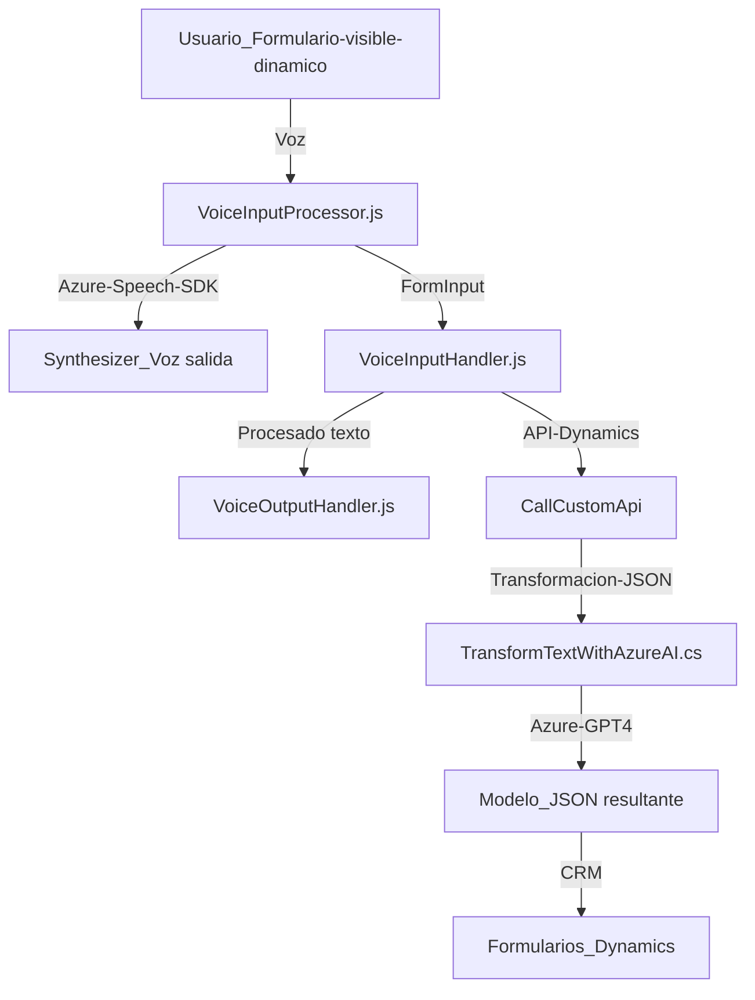

### Resumen técnico:
La solución contiene elementos que integran múltiples tecnologías y patrones para procesar voz y texto, principalmente dentro del contexto de formularios dinámicos de Dynamics CRM. Utiliza APIs externas (Azure Speech SDK y Azure OpenAI) para sintetizar y reconocer voz, además de transformar texto en JSON estructurado que se adapta a modelos predefinidos. Es ideal para mejorar accesibilidad mediante voz y para realizar entrada dinámica de datos basada en voz.

---

### Descripción de arquitectura:
La arquitectura combina principios de **desacoplamiento** y **integración de servicios externos**, con aproximaciones de **n capas** y **plugins**. Los componentes están organizados según las responsabilidades: 
1. **Frontend JS**:
   - Comunicación directa entre usuario y procesamiento de voz/texto.
2. **Backend (Plugins)**:
   - Procesamiento avanzado de texto con integración a servicios externos (Azure OpenAI y CRM Dynamics).

---

### Tecnologías usadas:
1. **Lado frontend (JavaScript):**
   - **Azure Speech SDK**: Biblioteca para síntesis y reconocimiento de voz.
   - **Dynamics CRM Xrm.WebApi.online**: API para interactuar con modelos de datos.
   - **DOM Manipulation**: Para configuración dinámica de scripts y actualización de contexto.

2. **Lado backend (C#/.NET):**
   - **Microsoft Dynamics CRM SDK (IPlugin)**: Extensiones personalizadas para Dynamics CRM.
   - **Azure OpenAI GPT-4**: Modelo de IA para análisis y transformación de texto.
   - **Newtonsoft JSON**: Para manipulación JSON estructurado.

---

### Diagrama Mermaid:

---

### Conclusión final:
Este repositorio implementa una solución **n capas** utilizando varios servicios externos (Azure Speech SDK, Azure OpenAI), modularidad en el frontend y extensiones en el backend. Promueve accesibilidad y entrada dinámica mediante interacciones basadas en voz y procesamiento inteligente de texto. La arquitectura es flexible y desacoplada, lo que permite actualizaciones de servicios externos sin afectar los componentes internos principales.