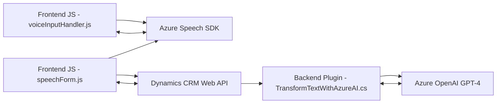

### Breve Resumen Técnico
El repositorio analiza e implementa una solución que integra **Azure Speech SDK** y **Azure OpenAI** en una plataforma **Dynamics CRM** para procesar entrada y salida de voz, transformar texto mediante IA, y mapear datos hacia formularios interactivos. Se divide principalmente en un frontend en **JavaScript** y un backend en **C#** para extender funcionalidades de CRM mediante plugins.

---

### Descripción de Arquitectura
- **Tipo de Solución**: API + Frontend + Plugins.
- **Arquitectura**:
  - Para el frontend, sigue un patrón **modular** con funciones independientes que interactúan directamente con APIs externas.
  - El backend utiliza un enfoque basado en **Plugin Architecture**, que se alinea con la extensibilidad de Dynamics 365.
  - La solución global es una combinación de **arquitectura n capas** y **Service-Oriented Architecture (SOA)**, donde el frontend actúa como intermediario entre el usuario, el servicio de CRM, y los servicios en la nube de Azure.

---

### Tecnologías Usadas
1. **Frontend**:
   - **JavaScript**: Modular para la integración con Azure Speech SDK.
   - **Azure Speech SDK**: Para síntesis y reconocimiento de voz.
   - **Dynamics CRM**: API interna usada para manipular datos de formularios.
   - **Event-driven programming**: Usado en el manejo dinámico del SDK.
   
2. **Backend**:
   - **C#**: Uso del Dynamics CRM Plugin Development.
   - **Azure OpenAI**: Procesamiento avanzado de texto (GPT-4).
   - **Dynamics 365 SDK**: Manipulación de entidades y contextos de ejecución.
   - **JSON Libraries**: `Newtonsoft.Json` y `System.Text.Json`.

---

### Dependencias o Componentes Externos Presentes
1. **Azure Speech SDK**: Amplias funcionalidades para transcripción y síntesis de voz.
2. **Azure OpenAI (GPT-4)**: Procesamiento de texto basado en IA.
3. **Dynamics CRM Web API**: Interacción con backend CRM.
4. **Newtonsoft.Json** y `System.Text.Json`: Manipulación estructurada de datos JSON.

---

### Diagrama Mermaid válido para GitHub

---

### Conclusión Final
La solución proporciona una integración avanzada entre tecnologías en la nube (Azure) y una plataforma empresarial (Dynamics CRM). Utiliza un enfoque mixto de arquitectura:
- **Frontend modular** basado en API para facilitar la interacción en tiempo real para entrada de voz y procesamiento de datos.
- **Backend basado en Plugins** para extender funcionalidad de CRM y delegar tareas complejas a servicios externos como OpenAI.

La arquitectura es escalable y extensible, con potencial para adaptar más servicios externos y funciones adicionales que potencien la experiencia del usuario y la automatización basada en IA.