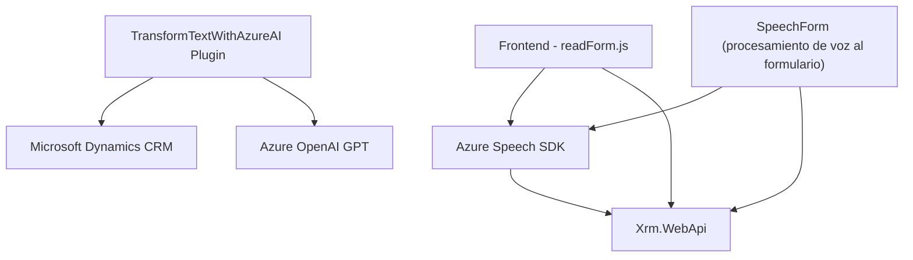

### Breve resumen técnico

El repositorio contiene elementos diseñados con funcionalidades de reconocimiento de voz, conversión de texto a audio y transformación de datos de formularios, además de integración con servicios de inteligencia artificial a través de Azure Speech SDK y Azure OpenAI. Se utiliza una lógica distribuida entre componentes de frontend JavaScript y plugins en backend para Microsoft Dynamics CRM.

---

### Descripción de arquitectura

La arquitectura empleada puede clasificarse como **n capas** con integración hacia componentes **serverless/cloud**. Los scripts JavaScript encapsulan las funcionalidades del frontend y se integran con Dynamics CRM (backend) mediante APIs, lo que indica una interacción cliente-servidor. A nivel de backend, se utiliza un diseño basado en **Eventos** para extender el CRM con el plugin, que utiliza Azure OpenAI para procesamiento de texto.

---

### Tecnologías usadas:

#### Frontend:
- **Azure Speech SDK**: SDK para conversión de voz a texto y texto a voz.
- **JavaScript**: Lenguaje base para la implementación.
- **AJAX/HttpClient (Xrm.WebApi)**: Para realizar solicitudes a APIs personalizadas y comunicaciones con servicios externos.

#### Backend:
- **Microsoft Dynamics CRM SDK**: Framework de extensibilidad para CRM.
- **Azure OpenAI Service**: GPT-4 para procesamiento de texto con reglas de normalización.
- **Newtonsoft.Json y System.Text.Json**: Para trabajar con JSON en el backend.
- **C#**: Para la implementación del plugin.

#### Otros:
- **Patrones de arquitectura**:
  - **Eventos**: El plugin para Dynamics CRM responde a eventos específicos.
  - **Encapsulación**: Cada funcionalidad está claramente separada en métodos/clases independientes.
  - **Gateway pattern**: Comunicación entre CRM y Azure OpenAI mediante APIs.
  - **Integración nube-externa**: Uso extensivo de servicios cloud (Azure Speech SDK y OpenAI).

---

### Diagrama Mermaid válido para GitHub:

---

### Conclusión final

La solución muestra una integración entre un frontend web basado en JavaScript que aprovecha tecnologías de reconocimiento de voz y texto a voz, en combinación con un backend extensible de Microsoft Dynamics CRM que incluye plugins y servicios de inteligencia artificial alojados en Azure. La arquitectura es claramente de **n capas** con alto grado de modularidad en sus componentes. Destaca el uso de Azure Speech SDK para permitir capacidades de accesibilidad y potencia de IA mediante Azure OpenAI para transformar y estructurar textos. La solución tiene potencial para escalar y optimizarse gracias a sus dependencias externas en servicios de nube. Sin embargo, sería ideal mejorar la gestión de la seguridad y las configuraciones sensibles como claves de API utilizando mecanismos de almacenamiento seguro.