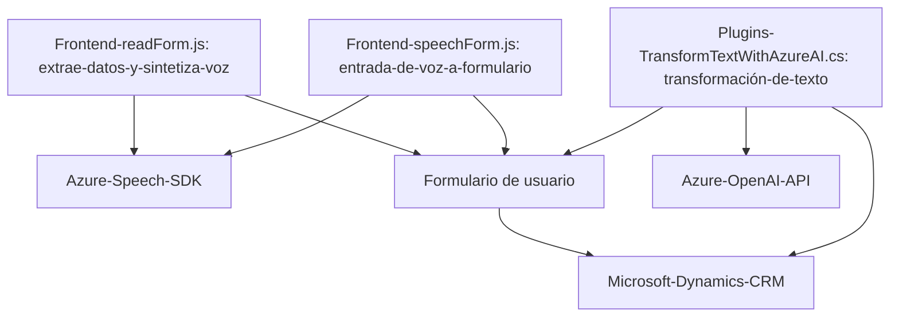

### Breve resumen técnico:
El repositorio contiene múltiples archivos que interactúan entre el frontend y tecnologías backend. Los tres archivos analizados presentan diferentes funcionalidades:
1. **FRONTEND/JS/readForm.js:** Extrae datos de un formulario y los convierte en audio usando Azure Speech SDK.
2. **FRONTEND/JS/speechForm.js:** Convierte entrada de voz en texto usando el Azure Speech SDK y procesa el texto transcrito dentro de un contexto de formulario.
3. **Plugins/TransformTextWithAzureAI.cs:** Implementa un plugin de Dynamics CRM que transforma texto utilizando la API de Azure OpenAI.

---

### Descripción de arquitectura:
#### Tipo:
La solución implementa una arquitectura basada en servicios y presenta una integración con servicios externos como APIs de Azure Speech y Azure OpenAI. Además, incluye extensiones del modelo **Plugin** de Microsoft Dynamics CRM para la automatización de tareas en aplicaciones empresariales.

#### Estructura:
La arquitectura es **n-capas**, dividiéndose en:
1. **Capa de Presentación:** Archivos de frontend (`readForm.js`, `speechForm.js`) que implementan lógica del cliente basada en SDK de Azure.
2. **Capa de Servicios:** El plugin (`TransformTextWithAzureAI.cs`) actúa como un componente que conecta Dynamics CRM con la API de Azure OpenAI para transformación de texto.
3. **Capa de Integración API:** Dependencias clave para comunicación con Azure (Speech SDK y OpenAI API).

---

### Tecnologías usadas:
1. **Frontend:**
   - **Azure Speech SDK:** Para la síntesis de texto a voz y entrada de voz desde el navegador.
   - JavaScript como lenguaje de programación.
2. **Backend:**
   - **Microsoft Dynamics CRM Plugin Framework:** Para extensiones de lógica personalizada en el contexto de CRM.
   - **Azure OpenAI API:** Para transformación avanzada de texto.
   - C# como lenguaje de programación.
3. **Dependencias externas:**
   - `Newtonsoft.Json` y `System.Text.Json` para manejo JSON.
   - `System.Net.Http` para solicitudes HTTP.
4. **Patrones y prácticas:**
   - Arquitectura basada en integración de servicios externos.
   - Separación de responsabilidades.
   - Uso de callbacks y funciones asíncronas para garantizar interoperabilidad con APIs.
   - Encapsulación de lógica de negocio en funciones/métodos especializados.

---

### Diagrama Mermaid válido para GitHub:

### Descripción del diagrama:
1. La presentación (frontend y plugins) interactúa con un formulario de usuario que se encuentra en el entorno de Dynamics CRM.
2. El frontend utiliza el **Azure Speech SDK** para sintetizar voz y procesar entrada de audio.
3. El plugin utiliza la **API de Azure OpenAI** para transformación avanzada de texto, comunicándose de manera remota mediante solicitudes HTTP.
4. El **Contexto del formulario en Dynamics CRM** es central, interactuando tanto desde el lado del cliente como del lado del servidor para mantener el flujo de datos integrados.

---

### Conclusión final:
El repositorio implementa una solución basada en **n-capas**, que integra APIs como Azure Speech y Azure OpenAI para funcionalidades avanzadas de reconocimiento y síntesis de voz, así como transformación del lenguaje en texto procesado. La lógica estructural está dividida claramente entre frontend, que se ocupa de la interacción del usuario y análisis in situ, y backend, que gestiona la lógica compleja en forma de plugins. Es una implementación adecuada para aplicaciones de sistemas empresariales como CRM, donde los datos del formulario requieren una gestión dinámica y formada a partir de integraciones inteligentes.