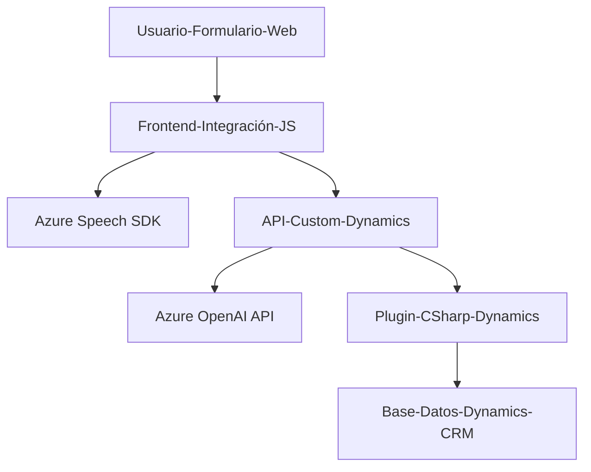

### Breve resumen técnico
El repositorio presenta una solución compuesta por varios archivos que integran un **frontend** en JavaScript para interacción con formularios y un **plugin backend** en C# para Dynamics CRM. La solución está orientada a transformar y sintetizar texto utilizando tecnologías como el **Azure Speech SDK** y el **Azure OpenAI API**.

---

### Descripción de arquitectura
La arquitectura general del sistema sigue un modelo **n-capas**:
- **Frontend (capa de presentación):**
  - Implementación en JavaScript que gestiona la interacción del usuario con formularios y la síntesis de texto a voz mediante el SDK de Azure Speech.
- **Backend (capa de integración/negocio):**
  - Un plugin en C# que interactúa con Dynamics CRM y se conecta a Azure OpenAI para realizar transformaciones avanzadas de texto.
- **Servicios externos (capa de integración):**
  - APIs de Azure Speech SDK y Azure OpenAI se utilizan como servicios externos que manejan voz y procesamiento basado en reglas.

Esta arquitectura está diseñada con separación de responsabilidades:
- El **Frontend** maneja la interacción del usuario y prepara datos para los servicios.
- El **Backend** implementa lógica avanzada como interacciones con APIs externas mediante HTTP y conecta con Dynamics CRM como el sistema principal.

---

### Tecnologías usadas
1. **Frontend (JavaScript):**
   - **Azure Speech SDK**: Para síntesis y reconocimiento de voz.
   - Funciones asincrónicas y promesas para manejar dependencias externas.
   - Modulación y separación de responsabilidades en funciones (`getVisibleFieldData`, `speakText`, etc.).
   
2. **Backend (C#):**
   - **Microsoft Dynamics CRM SDK**: Para la integración en forma de *plugin*.
   - **Azure OpenAI API**: Procesa texto utilizando aprendizaje profundo. 
   - Bibliotecas auxiliares como `System.Text.Json` y `Newtonsoft.Json`.

---

### Diagrama Mermaid

---

### Conclusión final
La solución implementada combina tecnologías modernas para el procesamiento de voz y texto con capacidades avanzadas de integración con un CRM. Su arquitectura modular y sus patrones de diseño aseguran escalabilidad y reutilización. En el *Frontend*, las funciones están bien estructuradas y utilizan SDK externos eficientemente, mientras el *Backend* añade potentes capacidades de procesamiento con IA usando APIs de Azure.