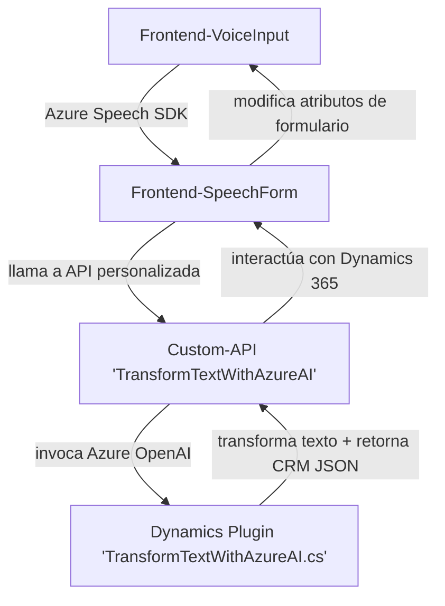

### Breve resumen técnico
El repositorio combina elementos de frontend (con JavaScript) y un plugin de backend (.NET) para aplicaciones Dynamics 365. Las soluciones involucran accesibilidad (texto a voz y reconocimiento de voz), manipulación dinámica de formularios de Dynamics, y procesamiento de datos textuales mediante servicios de IA (Azure Speech SDK y Azure OpenAI). Está desarrollado principalmente para integrar sistemas externos en una solución CRM de Microsoft.

---

### Descripción de arquitectura
La arquitectura es **n capas** con **integración de servicios externos**, ya que cada segmento del sistema tiene roles específicos:
1. **Capa de presentación** (JavaScript): Procesa datos del formulario, adapta accesibilidad (texto a voz, reconocimiento de voz) y permite la vinculación dinámica de datos con el contexto de negocio.
2. **Capa intermedia** (Custom API): Procesa texto y transcripciones con reglas específicas de negocio mediante IA.
3. **Capa de negocio** (Plugin en Dynamics CRM): Extiende las capacidades del sistema CRM utilizando la API Azure OpenAI, aplicando procesos avanzados de transformación de datos.

---

### Tecnologías usadas
- **Frontend (JavaScript):** 
  - Uso del **Azure Speech SDK** para sintetizar y reconocer voz.
  - Manipulación del DOM y formularios del modelado funcional en Dynamics 365 (`formContext`, etc.).
- **Backend (.NET):**
  - **Microsoft Dynamics SDK** para extender el CRM y conectar servicios externos.
  - **Azure OpenAI Service** para transformaciones avanzadas de texto.
  - **Newtonsoft.Json** y librerías de serialización/deserialización JSON.
- **Patrones:** Modularidad, integración de servicios externos, callbacks (event-based coding) y el patrón plugin para extender funcionalidad en sistemas Dynamics.

---

### Diagrama Mermaid válido para GitHub

---

### Conclusión final
Este sistema diseña una solución orientada a accesibilidad y automatización, transformando la interacción humana en un CRM mediante voz, texto, y servicios de IA. La arquitectura estructurada en n capas facilita su mantenimiento, escalabilidad y futuro soporte. Cada capa cumple roles claramente definidos, destacando la integración efectiva con servicios de Azure.