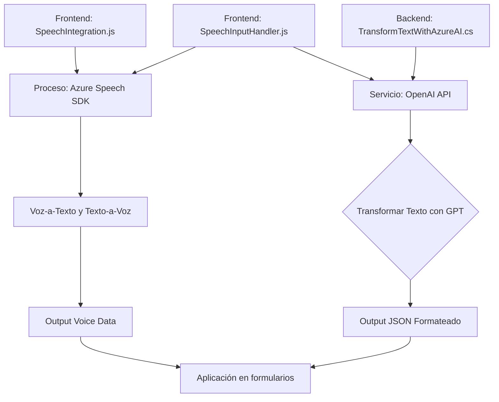

---

### Breve resumen técnico  
El repositorio contiene tres archivos que implementan funcionalidades relacionadas con la entrada y salida de voz, integración con APIs externas, y procesamiento de texto mediante servicios de IA. Está diseñado para integrarse con formularios en aplicaciones Dynamics CRM, utilizando tecnologías como **Azure Speech SDK** y **Azure OpenAI API**.

---

### Descripción de arquitectura  
La arquitectura puede clasificarse como **n-capas orientada a servicios**. Los archivos están organizados en capas funcionales:  
1. **Frontend (JS)**: Manejo de entrada y salida de voz sobre formularios visibles en la interfaz.  
2. **Backend (plugin en C#)**: Transformación de datos mediante IA y APIs externas con integración en Dynamics CRM.  

Los archivos aplican patrones como **modularidad**, **integración con SDK/APIs externas**, y **plugin-based design**, con división lógica de responsabilidades entre interacción directa con formularios (frontend) y procesamiento avanzado de datos (backend).

---

### Tecnologías usadas  
1. **Frontend**  
   - **Azure Speech SDK**: Procesamiento de voz (sintetización y transcripción).  
   - **JavaScript**: Manipulación y configuración del comportamiento en formularios.  

2. **Backend**  
   - **Microsoft Dynamics CRM SDK**: Extensión de funcionalidades del CRM mediante plugins.  
   - **Azure OpenAI API**: Implementación de IA para transformar texto según reglas definidas.  
   - **Newtonsoft.Json**: Manejo de estructuras JSON para comunicación con APIs.

---

### Diagrama Mermaid válido para GitHub  

---

### Conclusión final  
Este repositorio está diseñado para implementar capacidades avanzadas de accesibilidad y procesamiento de datos mediante integración con servicios externos como **Azure Speech SDK** y **Azure OpenAI API**. La arquitectura modular separa jerárquicamente el manejo de interfaz de usuario y la lógica de backend dentro del ecosistema de Dynamics CRM. Esto lo convierte en un ejemplo robusto de una solución **n-capas orientada a servicios**, ideal para entornos empresariales con necesidades de automatización y accesibilidad.